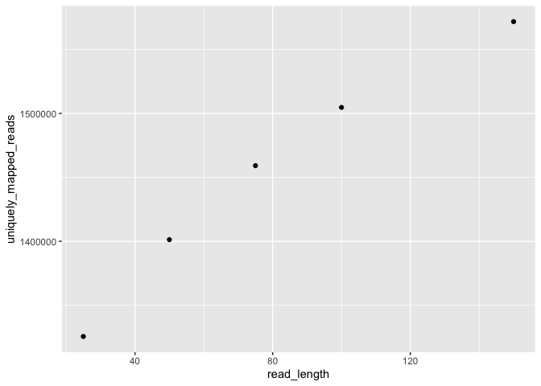
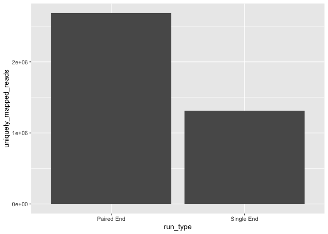

Assignment 3: Mappability
================

# Assignment Overview

This assignment’s goal is to familiarize you with some factors that can
affect read mappability. Assume that all the steps need to be performed
on the server and with your conda environment loaded, unless told
otherwise. The format that we will be following is a hypothetical case
that we hope no one will ever encounter in real life. Although remember
that much of this grief could have been prevented had the code and data
been backed up (e.g. on GitHub and elsewhere). As always remember that
you should not try to move or alter the reference files in any way. The
data is located under the */projects/bmeg/A3/* path (unless otherwise
specified).

## Deliverable:

From now on, you will need to specify the output of your Rmarkdown as a
github document using: **“output:github_document”** instead of the
*output:html_document* default. This will create a folder within your
working directory with all the plots created throughout your script,
which will be used to create an **.md** extension file. Both the
directory with the figures and the .md file will be required for you to
be evaluated. Make sure to have them on your private repo. To do this,
you need to:

    1. Make sure you have cloned your assignments repository to your local computer

    2. Download the Rmd of the assignment and add it to your repository on your local computer

    3. Edit the assignment to fill in the answers and add your R code

    4. Once you are done, knit your file. Double check that at the top of the Rmd under output, it has github_document

    5. Using your favorite github manager (like Github Desktop), commit your changes to your repository. 

    6. Pull to be up-to-date with any changes to your private repository. 

    7. Push the commit you made on step 6 to your repository. 

    8. Check that on your repository online you can see an *.md* extension file and a folder that includes the plots you created for the assignment, and that the plots are visible when viewing the .md file on GitHub. 

# Overboard data

You are a graduate student at UBC, doing ChIP-seq analysis to figure out
early development changes in histone mark sites. You are thrilled to
find that there are changes of H3K27me3 in your candidate genes. Your
professor is super happy and you are over the moon with your results.
However, you want to reanalyze the data to make sure everything makes
sense and your pipeline works correctly because you know the importance
of data reproducibility. Then the inexplicable happens. Someone forgot
to close a window at your lab and the server has been damaged by the
crazy Vancouver rain. All your data is lost and there is no way of
getting it back. You will need to sequence your samples again to get
back on track. This is deeply upsetting, however, you remember that you
didn’t know what you were doing when you set the sequencing parameters
for the experiment, so you decide to take this opportunity to apply all
the things you have learned in your Genome Informatics class.

## 0. Getting ready

As always, before we start we will make sure to have all the programs we
need to run. For this assignment we only need to install:

- trimmomatic: <http://www.usadellab.org/cms/?page=trimmomatic>

``` bash

#?# Add trimmomatic to your conda environment created on A1 - 0.5 pt
conda install -c bioconda trimmomatic 

# In some cases adding a new tool to your conda environmnet will upgrade or downgrade other dependencies that were already in your environment. 
#?# What could happen to your previous analysis code if you modify its dependencies in the conda environment now? - 0.5 pt
Your previous code will not run, because it was set up to run with the previous dependencies 
#?# How could you prevent this from happening? 0.5 pt
You can specify versions 
```

## 1. Sequencing parameters

There are two main things that you want further clarification on before
telling your Professor how do you want to do the next sequence run:
appropriate sequence length and run type (paired-end or single-end). You
have reviewed some of these concepts in class and you have a vague
notion of what you should use, but after the traumatic event of losing
all your data, you won’t take any chances and decide to make sure that
what you learned in class is right.

### a. Sequence length

As you reviewed in class, the sequence length affects the chances of
finding unique mapping sites in the genome (uniquely mapped reads).
Increasing read uniqueness is very important because it can greatly
affect the interpretation of the results of an experiment. Using a small
sequence length would leave you with lots of reads that map to several
sites in the genome (ambiguously mapped reads). On the other hand, you
are aware of exciting new technologies that are able to sequence
extremely long DNA fragments (Nanopore:
<https://nanoporetech.com/how-it-works>). But, you know that part of
your ChIP analysis is to break down the DNA to be able to capture DNA
sites where your histone mark is located. You have decided that you want
to see the percentage of uniquely mapped reads when you use different
read lengths. To do this, you decided to use **ONLY** the
**H3K27me3_iPSC_SRA60_subset_1.fastq.gz** file from your last assignment
located in **/projects/bmeg/A2** in the course server.

``` bash

#?# Use trimmomatic SE to crop the file down to 25 bp in length, type the command you use below - 1 pt
## Note: Remember to gzip all your files! Look into the trimmomatic documentation for how to specify to compress your output
trimmomatic SE H3K27me3_iPSC_SRA60_subset_1.fastq.gz H3K27me3_iPSC_SRA60_subset_1_25bp.fastq.gz CROP:25

#?# Use bowtie2 to map the _25bp_ read file you just created to the reference genome, type the command you use below: - 0.5 pt
bowtie2 -x /projects/bmeg/indexes/hg38/hg38_bowtie2_index -U /home/rdaswani_bmeg23/Assignment2/H3K27me3_iPSC_SRA60_subset_1_25bp.fastq.gz -S assignment3_align_25bp.sam


#?# Use sambamba view to get the number of uniquely mapped reads of the alignment output you got above,type the command you use below: - 0.5 pt
## NOTE: Remember to use the following flag:
## -F "[XS] == null and not unmapped and not duplicate"
## Tip: Check the sambamba documentation for options that will allow you to use the sam file as an input and automatically count the number of reads.
sambamba view -S -F "[XS] == null and not unmapped and not duplicate" -c assignment3_align_25bp.sam 

1325510
```

You realize that if you want to consider many different read lengths,
copying and pasting the above for each read length will be very
repetitive work and prone to bugs. Thus, you decide to use your recently
acquired knowledge of pipelines to create a mini version of it that will
take as input the desired read length, and output the number of uniquely
mapped reads when reads of this length have been mapped to the genome.

``` bash

## The following files have already been trimmed and aligned against the hg38 genome build, and can be found here: /projects/bmeg/A3
## H3K27me3_iPSC_SRA60_subset_1_LEN_150_mapped.bam 
## H3K27me3_iPSC_SRA60_subset_1_LEN_100_mapped.bam
## H3K27me3_iPSC_SRA60_subset_1_LEN_75_mapped.bam
## H3K27me3_iPSC_SRA60_subset_1_LEN_50_mapped.bam


### Create a mini pipeline that uses sambamba view to get the number of uniquely mapped reads for the files above, plus the 25bp length file you created for the previous question.
#?# Type the code of your mini pipeline below: - 3 pt
## You do not need to build in robustness to failure here since only one command is run with a single numerical output (so it would be hard to miss a failed run). 
## Have the pipeline also state the read length being considered before displaying the number of uniquely mapping reads (seperated by a comma).
## Have the pipeline save the results to a txt file.
set -e # this makes the whole script exit on any error.
sample=$1
b1=$1
logDir=MyLogDirectory3 # this is where all the files to keep track of progress will go.
mkdir -p MyLogDirectory3 # make the directory where log files will go, if it doesn't exist already
echo running pipeline for $sample 
if [ ! -e $logDir/$sample.mapped.done ] #run this code only if $logDir/$sample.mapped.done is missing
then
  echo Performing mapping of unique reads 
  ls /home/rdaswani_bmeg23/Assignment2/$b1
  echo $sample 
  
  length=$(sambamba view -c $b1)
  reads=$(sambamba view -c -F "[XS] == null and not unmapped annd not duplicate" $b1)
  
  echo "$length,$reads" >> output.txt 
  
  touch $logDir/$sample.mapped.done 
else 
  echo Already performed mapping of unique reads 
fi 

## Copy the job scheduler simulator used for last assignment: *runTheseJobsSerially.sh* to the directory you are using to work on this assignment (working directory)
## Substitute from the line below:
## <your_mini_pipeline> with the name you gave the pipeline you created on the previous question
## <your_taskfile> with a taskfile that includes the tasks you want to perform 
./runTheseJobsSerially.sh <your_mini_pipeline> <your_taskfile>

#?# Type the substituted line you used below: - 0.5 pt 
./runTheseJobsSerially.sh ./unique_pipeline.sh tasklist_3.txt

#?# Type the content of your taskfile below: - 0.5 pt 
H3K27me3_input_150    H3K27me3_iPSC_SRA60_subset_1_LEN_150_mapped.bam
H3K27me3_input_100    H3K27me3_iPSC_SRA60_subset_1_LEN_100_mapped.bam
H3K27me3_input_75     H3K27me3_iPSC_SRA60_subset_1_LEN_75_mapped.bam
H3K27me3_input_50     H3K27me3_iPSC_SRA60_subset_1_LEN_50_mapped.bam
H3K27me3_input_25     assignment3_align_25bp.bam
```

Now that you have the number of uniquely mapped reads for the different
reads size, you want to make a nice graph to show your supervisor you
know what you are talking about when you say the sequence length has an
effect on the number of uniquely mapped reads. Download your results
file. **On your local computer**:

``` r
## First, we read our results file into a dataframe. Substitute "results.txt" with the name of your file.
#?# Substitute the sequence lengths with their respective number of uniquely mapped reads, that you got from sambamba view: - 0.5 pt
length_mapped_reads.df <- read.csv("output.txt",header=FALSE)

## Use the names function to give your dataframe column headers
#?# Fill in the right side of the following line: - 0.5 pt
names(length_mapped_reads.df) <- c("read_length", "uniquely_mapped_reads")


## If you don't have it already, install the "ggplot2" package on your Rstudio 
## Go to packages on the bottom left part of the screen --> install --> type: ggplot2
## Accept to install the required dependencies
                    
#?# Create a scatterplot using ggplot2 - 2 pt
## Use the reads_length for the x axis, uniquely_mapped_reads for the y axis.
library(ggplot2)
ggplot(length_mapped_reads.df, aes(x = read_length, y = uniquely_mapped_reads)) + geom_point()
```

<!-- -->

``` r
## Tips:
## You can look for tutorials on the internet, or use ggplot2's help to learn how to do this. 
## To search for help on a function, use the ? command. For instance: 
?geom_point


#?# How many uniquely mapping reads do you think you would get if you trimmed the reads down to 15 bp and aligned them single ended? Why? - 2 pt
#you would get a lower number of uniquely mapped reads as the trend shows that as the number of bp decrease, the number of uniquely mapped reads decrease as well. So you would expect to get something below 1325510 uniquely mapped reads. Additionally, single ended sequencing gives you less reads compared to paired end sequencing. So, for 15 bp you would approximately get 795306 uniquely mapped reads

#?# Approximately how many more perfect matches to the genome would the average read of length 14 have compared to the average read of length 15? (You can assume that the genome is comprised of completely random sequence for the purpose of this question). - 1 pt
#When comparing to the average read length of 15 bp, you would approximately get 742285 uniquely mapped reads for the length of 14 bp.
```

### b. Paired-end vs Single-end reads

Now that you have shown that the longest read length yields the highest
number of uniquely mapped reads, you decide to test the difference
between a paired-end run versus a single-end run.

``` bash

## Using the following files: 
# /projects/bmeg/A3/H3K27me3_iPSC_SRA60_subset_1_LEN_25.fastq.gz
# /projects/bmeg/A3/H3K27me3_iPSC_SRA60_subset_2_LEN_25.fastq.gz

## And the index of the hg38 genome build: 
## /projects/bmeg/indexes/hg38/hg38_bowtie2_index

#?# Perform a paired-end (PE) alignment to the genome, type the command you used below: - 1 pt
bowtie2 -x /projects/bmeg/indexes/hg38/hg38_bowtie2_index -1 /projects/bmeg/A3/H3K27me3_iPSC_SRA60_subset_1_LEN_25.fastq.gz -2 /projects/bmeg/A3/H3K27me3_iPSC_SRA60_subset_2_LEN_25.fastq.gz -S assignment3_PE_align.sam

#?# Do a single-end (SE) alignment to the genome of the subset_1 file, type the command you used below: - 1 pt
bowtie2 -x /projects/bmeg/indexes/hg38/hg38_bowtie2_index -U /projects/bmeg/A3/H3K27me3_iPSC_SRA60_subset_2_LEN_25.fastq.gz -S assignment3_SE_align.sam

#?# Convert the PE sam file to bam format, type the command you used below: - 0.5 pt
samtools view -b -h assignment3_PE_align.sam > assignment3_PE_align.bam

#?# Convert the SE sam file to bam format, type the command you used below: - 0.5 pt
samtools view -b -h assignment3_SE_align.sam > assignment3_SE_align.bam
## Before moving on: remove the PE and SE sam alignment files!

#?# Use sambamba view to get the number of uniquely mapped reads for the PE alignment, type the command you used below: - 0.5 pt 
sambamba view -F "[XS] == null and not unmapped and not duplicate" -c assignment3_PE_align.bam
2686235
#?# Use sambamba view to get the number of uniquely mapped reads for the SE alignment, type the command you used below: - 0.5 pt 
sambamba view -F "[XS] == null and not unmapped and not duplicate" -c assignment3_SE_align.bam
1316690
```

Your supervisor liked so much the graphical representation of your data,
that he asks you to do a barplot for the SE versus PE alignment
comparison.**On your local computer:**

``` r
## First, we create a dataframe with two columns, one (run_type) for the different run types and another (uniquely_mapped_reads for the number of uniquely mapped reads.
#?# Substitute the SE and PE with their respective number of uniquely mapped reads that you got from sambamba view: - 1 pt
sequence_run.df <- data.frame(run_type=c("Single End", "Paired End"),
                              uniquely_mapped_reads=c(1316690,2686235))


#?# Using ggplot, create a barplot that shows the different number of uniquely mapped reads between the two run types: - 2 pt
## Use the run_type in the x-axis
## Use the uniquely_mapped_reads in the y-axis
ggplot(sequence_run.df, aes(x = run_type, y = uniquely_mapped_reads)) + geom_col()
```

<!-- -->

``` r
#?# Does the run type makes a difference? If there is, is it large? - 1 pt
#Yes, the run type does make a difference. There are more uniquely mapped reads in the paired end run compared to the single end alignment. The difference is large, around 1369545 reads is the difference in uniquely mapped reads between paired end and single end alignment. 

#?# In your own words explain the difference between SE and PE read alignment. - 1 pt
#In single end read alignment, the sequencer will read the fragment only from one end to the other, which gives you the sequence of base pairs. In paired end read alignment, it starts the read in one direction at the specific read length and does another read from the opposite end of the fragment. 

#?# Given that the 50 bp reads (from last graph) contain the same number of bases as two 25 bp reads (25 bp PE; 25+25=50), why are the number of uniquely mapping reads different between these two? Which has more? Why do you think this is? - 3 pts
#The number of uniquely mapped reads of the 50 bp from the last graph is 1401280 and the number of uniquely mapped reads for the two 25 bp reads are 4002925. The two 25 bp reads have a higher number of uniquely mapped reads because one is paired end and one is single end leading to more unique reads whereas the 50 bp is just paired end. 
```

## Assignment submission

Please knit your Rmd file to *github_document* and include the link to
the .md file in your Canvas submission. Successful knitting to
github_document - 2 pts

# Authors and contributions

Following completion of your assignment, please fill out this section
with the authors and their contributions to the assignment. If you
worked alone, only the author (e.g. your name and student ID) should be
included.

Authors: Rishika Daswani (59028654)

Contributions: (example) N1 and N2 worked together on the same computer
to complete the assignment. N1 typed for the first half and N2 typed for
the second half.
