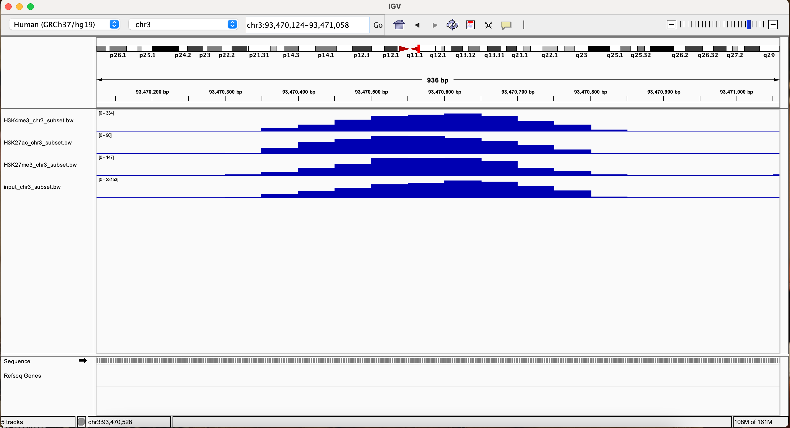
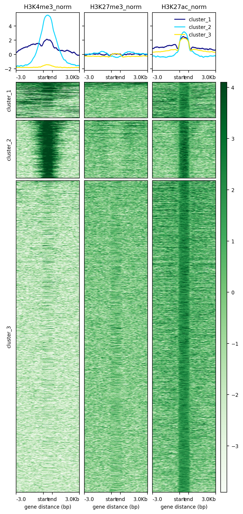

---
title: "Assignment 5: ChIP analysis"
output:
  github_document:
    toc: true
    toc_depth: 4
---

# Assignment Overview

By now you must have become vaguely familiar with ChIP-seq data but might be a little confused about what to do after the alignment. This assignment's aim is to walk you through a ChIP-seq pipeline post-alignment. We will be analyzing three different histone modification marks (H3K27me3, H3K4me3 and H3K27ac). In order to identify the enrichments for each epigenetic mark, we also need to use the *input* which represents the DNA content of the sheared chromatin sample prior to immunoprecipitation. All the files can be found under the following path: **/projects/bmeg/A5/** . 

  - H3K27me3 (H3K27me3_chr3_subset.bam) 

  - H3K4me3 (H3K4me3_chr3_subset.bam) 

  - H3K27ac (H3K27ac_chr3_subset.bam) 

  - input (input_chr3_subset.bam)


A couple of things to remember: 

- When uploading your completed assignment to your GitHub directory, remember to specify a **github_document** instead of the default *html_document* on your .Rmd file. 

- Double check that all the files have been uploaded to your repository and that you are able to visualize the html-like version on GitHub. 

- Be mindful of your space on the server! Delete ALL unnecessary files and keep a clean environment. 

- Make sure you add your and your partner's names and student IDs to the end of the assignment.


## 0. Getting Started 

We will be using a couple of new tools this time. Before we move on to the practical part, make sure you have them all installed. 

  - Integrative Genomics Viewer (IGV): Interactive tool to visualize different data types of genetic information (e.g. bam, bed files). You will install this tool to your **local computer**. To visualize where the reads of our ChIP analysis mapped in the genome. To install it, follow the instructions on this website: *https://software.broadinstitute.org/software/igv/home*
  
  - Deeptools (https://deeptools.readthedocs.io/en/develop/index.html): Software to analyze high-throughput data that allows to create easy to visualize figures. This will be installed on the server as part of your conda environment.
  
  - macs2 (https://github.com/macs3-project/MACS/blob/master/docs/callpeak.md): Tool to capture enrichments of ChIP-seq analysis. This will be installed on the server as part of your conda environment.
  

```{bash, eval=FALSE}

#?# Add macs2 and deeptools to your environment created on A1 - 1 pt
conda install -c bioconda deeptools 
conda install -c bioconda macs2 

## Install IGV to your local computer after downloading it from: https://software.broadinstitute.org/software/igv/home

```


## 1. ChIP signal tracks 

ChIP-seq experiments require a control against which to compare the ChIP signal. Often this is the "input DNA", sheared chromatin that has not been immmunoprecipitated. For this assignment we are using an input and three different epigenetic marks. These histone modifications mark states of active (H3K27ac, H3K4me3) or inactive (H3K27me3) gene transcription and have different coverage of the genomic region where they are located. To better visualize the differences, we will create bigWig files from previously aligned, filtered and indexed bam files. BigWig files are indexed, compressed files that can be used to visualize signals across the genome. Here, we will be using it to graph the coverage across the genome.


```{bash, eval=FALSE}

## Use the bamCoverage command (included in deepTools) to convert the bam files outlined below (located in the /projects/bmeg/A5/ directory) into bigwig files that represent the read coverage (e.g. density of reads across the genome). Each file has already been indexed using sambamba and hence, has it's bam index (.bai) file associated that you will need to run bamCoverage. 
## Tip: Remember to add the .bw extension to your specified output! 

#?# Type the commands you use for converting each of the 4 bam files to bigwig files - 2 pts
## H3K27ac_chr3_subset.bam
bamCoverage -b /projects/bmeg/A5/H3K27ac_chr3_subset.bam -o /home/rdaswani_bmeg23/Assignment5/H3K27ac_chr3_subset.bw 

## H3K4me3_chr3_subset.bam
bamCoverage -b /projects/bmeg/A5/H3K4me3_chr3_subset.bam -o /home/rdaswani_bmeg23/Assignment5/H3K4me3_chr3_subset.bw 

## H3K27me3_chr3_subset.bam
bamCoverage -b /projects/bmeg/A5/H3K27me3_chr3_subset.bam -o /home/rdaswani_bmeg23/Assignment5/H3K27me3_chr3_subset.bw 

## input_chr3_subset.bam
bamCoverage -b /projects/bmeg/A5/input_chr3_subset.bam -o /home/rdaswani_bmeg23/Assignment5/input_chr3_subset.bw 

#?# Last time we used bed files to store mapped & annotated genomic features. ** Briefly ** explain the difference (if any) between bed files and bigwig files. - 1 pt

#bigwig files are whole-genome coverage tracks which means that you would need to call peaks on the file. It is an indexed binary format which displays continuous dense data. Bed file format provides a flexible way to define the data lines that are displayed in annotation track. They have three required fields, chrom, chromStart and chromEnd. Bigwig files are human readable whereas .bam files are not. 

### Follow these steps: 

## 1. Copy the bigwig files from the previous steps to your computer 
scp rdaswani_bmeg23@orca1.bcgsc.ca:/home/rdaswani_bmeg23/Assigment5/H3K27ac_chr3_subset.bw ~/Desktop/BMEG591-Assignments 
#same command for all files, but replace file name 

## 2.Load all the files bigwig signal track files onto IGV on your local computer, right-click and select the "autoscale" option for each file on their individual tracks
## Tip: use the "File" tab to "load from file" option to choose the files from your computer directories

## 3. Change the visualization of the files to see the following position: ** chr3:93,470,124-93,471,058 **
#?# Include a screenshot of your IGV session right after this code chunk (using the Rmarkdown syntax)  - 2 pt

#?# Explore this region by zooming in and out and navigating around. What do you see? Is there something similar across all the different files that stands out on this region? Is there anything peculiar about the DNA sequence at this locus?- 3 pt
#All the four files look fairly similar in this locus. They all have a signal at this location however, it is near the centromere which tends to not be a great signal and hence is a blacklisted region. When you zoom in, you can see that its only N nucleotides which means that the sequence quality was not good.   

## Tip: sometimes track signal will be truncated to a pre-set maximum. If you right-click the track label (left) and select "autoscale", it will automatically adjust the scales of the track to the range of your data. Try playing around with the track settings to see their effect.

## 4. This file (/projects/bmeg/A5/hg38_blacklisted_regions.bed) contains the hg38 blacklisted regions. Load it into IGV along with all the other files. 
scp rdaswani_bmeg23@orca1.bcgsc.ca:/projects/bmeg/A5/hg38.blacklist.bed ~/Desktop/BMEG591-Assignments

## 5. Look at the following region again (chr3:93,470,124-93,471,058). 
#?# What can you say now about the similarities between the files at this region? In your own words, explain what a blacklisted region is and if you think this region should be excluded a ChIP-seq analysis. - 1.5 pt
#Blacklisted regions within ChIP-seq data is essentially genomic regions that produce artifacts and noise, they represent un-annotated repeats in the genome. It should be excluded in order to reduce/eliminate background noise which can be misconstrued as changes in biological variation. Further, you would remove them in order to reduce the number of tests. If you remove blacklisted regions then you would not have to do tests such as the multiple correction test. 

#?# Does it matter whether your bam files are mapped to the same genome build (hg19 vs hg38)? Why or why not? How could you confirm whether this is the case? - 1.5 pts
#yes, it does matter. Reads mapped to one genome build are not interchangeable with reads mapped to another genome build. You can see that the genome build matters by loading two bigwig files you suspect might be on the different reference builds into IGV. You can confirm that its important that bam files are mapped to the same genome build because if not, the peaks are not going to make sense. 

```

**Add screenshot of your IGV session here: **. (Use Rmarkdown syntax)



## 2. Narrow vs Broad peaks 

While exploring the bigwig files of the epigenetic marks on IGV, you probably noticed that they can look very different from each other and some of them reassemble the input more closely than others. Different epigenetic marks can have very different signatures based on their distribution patterns across the genome. When calling peaks, we often lump these into two different categories of reads: broad and narrow. Activating transcription marks (H3K4me3 and H3K27ac) tend to form a sharper coverage peaks at transcription start sites (H3K27ac is also at enhancers), while repression marks cover a broader area (H3K27me3). Here, we're going to inspect their distributions relative to genes.

```{bash, eval=FALSE}


## Here, we have created three bigWig track files, one for each epigenetic mark, which show the read coverage normalized using the input. They are found here: /projects/bmeg/A5/
# H3K4me3_norm.bw
# H3K27me3_norm.bw
# H3K27ac_norm.bw


## The deepTools ** computeMatrix reference-point ** command calculates scores to represent the reads mapping to specified regions of the genome across different files. 
## Use computeMatrix to compute a matrix for the signal tracks for each histone modification outlined above (which we will use to create a plot in the following step), with the following criteria: 

## - We will use the regions in reference_genes.bed located under the /projects/bmeg/A5/ directory as the basis for the plot.
## - Include the surrounding 3kb
## - Use all 3 input-normalized bigWig files (H3K4me3, H3K27ac, H3K27me3) as signal tracks
#?# Write the command you used to run it below: - 1.5 pt
computeMatrix scale-regions -S H3K4me3_norm.bw H3K27me3_norm.bw H3K27ac_norm.bw -R /projects/bmeg/A5/reference_genes.bed -b 3000 -a 3000 -o histone_modification_matrix.gz


## Now that the scores matrix has been computed, we can use it to create a heatmap to provide a better visual representation of the reads distrubution across our reference genes (provided in the reference_genes.bed file)
## Use the deepTools ** plotHeatmap ** function to create a heatmap following this criteria: 
## - Use the matrix from the previous point
## - Use the Greens colormap
## - Create 3 clusters within the heatmap according to the patterns of the reads distrubution across the files using heirarchical clustering
#?# Type the command you used to run it below: - 1.5
#?# Add a screenshot of the plot right after this code chunk using Rmarkdown syntax - 1 pt 
plotHeatmap -m histone_modification_matrix.gz --colorMap 'Greens' --hclust 3 -o heatmap1.png  


#?# Explain what you are looking at (Axes, colours, curves). Where are the marks located? What are the differences between the clusters? - 3 pts
#The y axis shows ChIP signals, in the normalized heatmap, the signal has been subtracted by the input which makes axis different to raw because the input has not been subtracted. The x axis shows the results for different genes, 3000 base pairs upstream of each gene. The dark green regions show high signal within those genes and those are where the marks are located. The marks are differently dispered based on ChIP seq type and cluster. For example, in cluster 2 for h3k4me there is lots of marks before TSS. The difference between the clusters has been explained using the H3K27me3_norm file. For H3K27, cluster 3 is pretty uniformed compared to cluster 2 and 1. Signals for cluster 1 and 2 go up and down with cluster 2 showing the highest signal. Cluster 1 shows large signals after TES. 
```

**Add screenshot here: ** (Use Rmarkdown syntax)


```{bash, eval=FALSE}

## Now the above heatmap was made with the ratio of ChIP to input. Repeat the process above, but this time using the raw bigwig files (not input-normalized). 
#?# Type the commands you used for this below - 1 pt
computeMatrix scale-regions -S H3K27ac_chr3_subset.bw H3K4me3_chr3_subset.bw H3K27me3_chr3_subset.bw -R /projects/bmeg/A5/reference_genes.bed -b 3000 -a 3000 -o histone_modification_raw_matrix.gz

plotHeatmap -m histone_modification_raw_matrix.gz --colorMap 'Greens' --hclust 3 -o heatmap2.png


#?# Include a screenshot of this analysis, below this code block. - 1 pt
#?# How does this compare to the input-normalized data? Why do you think this is? - 1 pt
#the normalized data were able to indicate the marks better, using the raw files, you are unable to see the distribution of genes properly. This is because in the normalized data you are subtracting the input values from the signal which make it better compared raw. 
```

**Add screenshot here: ** (Use Rmarkdown syntax)


## 3. Peak calling 

Now we want to identify enriched regions of the genome for each of our three histone marks. In order to get the enrichments, we will run the **macs2** program to call the peaks for each epigenetic mark. 

### a. Peak calling with macs2


```{bash, eval=FALSE}

## Tip: Make sure to read the documentation (using the -h flag) for the *masc2 callpeak* command
## Run the callpeak command of the macs2 tool, once for each of H3K27ac, H3K27Me3, H3K4Me3
## Each time, use the input as the control 
## For H3K27Me3, you should call "broad" peaks because these signals tend to form longer domains and not acute peaks.
#?# Type the commands you used below: - 1.5 pt

macs2 callpeak -t /projects/bmeg/A5/H3K27ac_chr3_subset.bam -c /projects/bmeg/A5/input_chr3_subset.bam -n H3K27ac

macs2 callpeak -t /projects/bmeg/A5/H3K27me3_chr3_subset.bam -c /projects/bmeg/A5/input_chr3_subset.bam --broad -n H3K27me3

macs2 callpeak -t /projects/bmeg/A5/H3K4me3_chr3_subset.bam -c /projects/bmeg/A5/input_chr3_subset.bam -n H3K4me3


```


### b. Understanding the peaks

Macs2 calls the peaks by analyzing the enrichments of sequences in the genome compared to the input. The algorithm uses different measures to ensure the enrichments are statistically significant and make biological sense based on the sequence length, the expected peaks (narrow or broad) and other parameters. We will focus on the H3K4me3 mark to visualize how are the peaks are identified.

```{bash, eval=FALSE}

## 1. Copy the H3K4me3 .narrowPeak file to your local computer
scp rdaswani_bmeg23@orca1.bcgsc.ca:/home/rdaswani_bmeg23/Assignment5/H3K4me3_peaks.narrowPeak ~/Desktop/BMEG591-Assignments
## 2. Open IGV with and load the hg38 reference 

## 3. Load the following files:
### a. H3K4me3 bigwig file that you created in section 1 
### b. Input  bigwig file that you created in section 1 
## Note: remember to autoscale each file track!

## 4. Go to this position: ** chr3:27,610,219-27,740,792 **

#?# Compare the input and H3K4me3 signal tracks (a and b), are there regions that you consider to have an enriched signal in the H3K4me3 track compared to the input? If yes, how many?- 0.5 pt 
yes, around 4 regions 

#?# Why do you consider those regions to have an enrichment? Would you need to confirm that the enrichment is statistically significant? If so, what do you think would be a way to test for the significance (you can mention the tools used on this assignment or explain conceptually what would you do to confirm an enrichment)? - 1 pt

#Because they have signal that is high value compared to the input (you have to take into account the y axis). Its pretty obvious in this case that its statistically significant, but you could use macs2 to test for the enrichment in the area. Peak calling is a statistical analysis done to find enriched areas. 

## 5. Load into the same session the following files:
### c. H3K4me3 normalized using the input bigWig file that was pre-computed and you used on section 2
scp rdaswani_bmeg23@orca1.bcgsc.ca:/projects/bmeg/A5/H3K4me3_norm.bw ~/Desktop/BMEG591-Assignments
### d. H3K4me3 .narrowPeak file that you created in section 3a
## Note: remember to autoscale each file track!

## 6. Go to the same position as in step 4

#?# Does the region/s you thought had an enrichment show differences between the input and the H3K4me3 mark in the bamCompare (file c)? - 0.5 pt
#The regions we see as having enrichment are above 0 in the normalized file, showing differences between the input and the H3K4me3 file 

#?# Are these visually enriched regions you selected, found in file d (narrowPeak)? What does that mean? - 1 pt
# Yes. This means that the areas of enrichment are statistically significant. The narrowPeak, though discrete, shows that there are actually more than 4 peaks though. There is 8 discrete peaks.

#?# If the visually enriched regions were not found in file d (narrowPeak), what would you conclude? - 1 pt 
# That the chip signal was probably just noise that was not statistically significant when the input (aka the background signal) is considered.

#?# Add a screenshot of your IGV session right after this chunk, using Rmarkdown syntax - 1pt

```

### c. Peak enrichments

For this assignment, we are working with 3 different epigenetic marks: H3K4me3, H3K27me3 and H3K27ac. Each of these marks a different transcription state (i.e., activation or repression). Thus, to better visualize the differences in the called peaks for each of these epigenetic marks you will create a heatmap plot (like the one you created on part 2) using their called peaks files (.narrowPeak or .broadPeak). 


```{bash, eval=FALSE}


### Create 3 heatmaps following the specifications you used on part 2 (one for the peaks called for each epigenetic mark, both containing data from all three tracks). Use the peak files of each of the epigenetic marks as reference files (instead of the reference_genes.bed file used in part 2) . Use ONLY the input normalized files: H3K27ac_norm.bw H3K27me3_norm.bw H3K4me3_norm.bw
#?# Write the commands you used to compute the matrices and create the heatmaps below: - 3 pt

computeMatrix scale-regions -S /projects/bmeg/A5/H3K4me3_norm.bw /projects/bmeg/A5/H3K27me3_norm.bw /projects/bmeg/A5/H3K27ac_norm.bw -R H3K4me3_peaks.narrowPeak -b 3000 -o H3K4me3_narrowmatrix.gz -a 3000 

computeMatrix scale-regions -S /projects/bmeg/A5/H3K4me3_norm.bw /projects/bmeg/A5/H3K27me3_norm.bw /projects/bmeg/A5/H3K27ac_norm.bw -R H3K27ac_peaks.narrowPeak -b 3000 -o H3K27ac_narrowmatrix.gz -a 3000 

computeMatrix scale-regions -S /projects/bmeg/A5/H3K4me3_norm.bw /projects/bmeg/A5/H3K27me3_norm.bw /projects/bmeg/A5/H3K27ac_norm.bw -R H3K27me3_peaks.broadPeak -b 3000 -o H3K27me3_broadmatrix.gz -a 3000 

plotHeatmap -m H3K4me3_narrowmatrix.gz --colorMap 'Greens' --hclust 3 -o H3K4me3_narrowpeak.png --startLabel 'start' --endLabel 'end' 

plotHeatmap -m H3K27ac_narrowmatrix.gz --colorMap 'Greens' --hclust 3 -o H3K27ac_narrowpeak.png --startLabel 'start' --endLabel 'end'

plotHeatmap -m H3K27me3_broadmatrix.gz --colorMap 'Greens' --hclust 3 -o H3K27me3_broadpeak.png --startLabel 'start' --endLabel 'end'

#?# Add screenshots of the 3 heatmaps you got using the epigenetic marks' peak files as reference files. Add them after this code chunk (using Rmarkdown syntax) in the following order: H3K4me3, H3K27ac, H3K27me3 - 1.5 pt


```




```{bash, eval=FALSE}

#?# Do you see an overlap between the peaks of different epigenetic marks? Which epigenetic marks? - 1 pt
# H3K4me3 overlaps very strongly with H3K27ac 
# H3K27me3 does NOT overlap with H3K4me3 and H3K27ac. In fact its the opposite. There is a clear lack of overlap between H3K27me3 and H3K4me3/H3K27ac

#?# Why do these epigenetic marks overlap? - 1 pt
#H3K4me3 and H3K27ac are both affiliated with enhancers and promoters that are active (https://doi.org/10.1038/s41598-021-95398-5)

#?# Explain the pattern you see for the peaks of H3K27me3, do they look similar or different to the other two marks? Why do you think this happens? - 1 pt
# The pattern is that there is a some overlap in the NON PEAK regions surrounding the chipseq peak. But in the actual H3K27ac and H3K4me3 peak. There is very little H3K27me3 signal, it very clearly drops off in almost all of the clusters. I think this happens because the H3K27me3 mark is affiliated with heterochromatin (https://doi.org/10.1186/1756-8935-8-3), but the other marks are affiliated with activated genes (https://doi.org/10.1038/s41598-021-95398-5). We are not expecting to see overlap in the peaks because that would imply that a gene is actively expressing in a heterochromatin region, which biologically problably does not occur.

#?# Why do some of the ChIP peaks have such clearly defined borders for some ChIP signals? - 1 pt
# Because the proteins that correspond to those ChIP signals bind to very specific genomic regions.For example, in the H3K4me3 ChIP peaks, there is a very clear overlap with the H3K27ac peaks. This is because, biologically, these two are very strongly associated. Additionally, there are clearly defined boarders for some signals because the binding of TFs can be localized to one specific region and not spread out like some histone modifications can be. 
```


# Assignment submission

Please knit your Rmd file to *github_document* and include the link to the .md file in your Canvas submission.


# Authors and contributions

Following completion of your assignment, please fill out this section with the authors and their contributions to the assignment.  If you worked alone, only the author (e.g. your name and student ID) should be included.

Authors: Rishika Daswani (59028654) and Alex Adrian (32879231)

Contributions: Rishika Daswani and Alex Adrian worked on different computers. Rishika completed part 1 and 2 of the code and Alex completed part 3. Rishika and Alex worked on the explanation/theory questions together 

