Assignment 6: ATAC-seq
================

- <a href="#assignment-overview" id="toc-assignment-overview">Assignment
  overview</a>
- <a href="#part-0-getting-ready" id="toc-part-0-getting-ready">Part 0:
  Getting ready</a>
  - <a
    href="#-recall-that-each-row-is-a-peak-and-each-column-is-a-treatmentreplicatetimepoint-triplet-report-the-value-listed-for-chr125429953-25431146-in-the-br_protac-treatment-after-6-hours---025-pt"
    id="toc--recall-that-each-row-is-a-peak-and-each-column-is-a-treatmentreplicatetimepoint-triplet-report-the-value-listed-for-chr125429953-25431146-in-the-br_protac-treatment-after-6-hours---025-pt"><code>#?#</code>
    <em>Recall that each row is a peak and each column is a
    treatment/replicate/timepoint triplet. Report the value listed for
    chr1:25429953-25431146 in the BR_protac treatment after 6 hours. - 0.25
    pt</em></a>
  - <a
    href="#-compare-the-values-with-those-for-the-control-treatment-at-the-same-time-and-position-are-the-counts-higher-or-lower-than-the-count-for-br_protac---025-pt-"
    id="toc--compare-the-values-with-those-for-the-control-treatment-at-the-same-time-and-position-are-the-counts-higher-or-lower-than-the-count-for-br_protac---025-pt-"><code>#?#</code>
    <em>Compare the value(s) with those for the control treatment at the
    same time and position. Are the counts higher or lower than the count
    for BR_protac? - 0.25 pt </em></a>
  - <a
    href="#-does-a-high-value-for-a-given-position-in-the-count-matrix-indicate-high-accessibility-or-low-accessibility-for-that-region---05-pt"
    id="toc--does-a-high-value-for-a-given-position-in-the-count-matrix-indicate-high-accessibility-or-low-accessibility-for-that-region---05-pt"><code>#?#</code>
    <em>Does a high value for a given position in the count matrix indicate
    high accessibility or low accessibility for that region? - 0.5
    pt</em></a>
- <a href="#part-1-understanding-the-experiment"
  id="toc-part-1-understanding-the-experiment">Part 1: understanding the
  experiment</a>
  - <a
    href="#-make-the-above-plot-each-point-should-represent-one-of-the-samples---1-pt"
    id="toc--make-the-above-plot-each-point-should-represent-one-of-the-samples---1-pt"><code>#?#</code>
    <em>Make the above plot. Each point should represent one of the samples.
    - 1 pt</em></a>
  - <a
    href="#-can-we-compare-brm014-to-dmso-across-all-time-points-whywhy-not---1-pt"
    id="toc--can-we-compare-brm014-to-dmso-across-all-time-points-whywhy-not---1-pt"><code>#?#</code>
    <em>Can we compare BRM014 to DMSO across all time points? Why/why not? -
    1 pt</em></a>
- <a href="#part-2-qc" id="toc-part-2-qc">Part 2: QC</a>
  - <a
    href="#-make-a-plot-with-read-coverage-on-the-y-axis-total-number-of-reads-and-the-samples-on-the-x-axis---3-pt"
    id="toc--make-a-plot-with-read-coverage-on-the-y-axis-total-number-of-reads-and-the-samples-on-the-x-axis---3-pt"><code>#?#</code>
    Make a plot with read coverage on the y-axis (total number of reads) and
    the samples on the x-axis. - 3 pt*</a>
  - <a href="#-which-sample-has-the-most-coverage---05-pt"
    id="toc--which-sample-has-the-most-coverage---05-pt"><code>#?#</code>
    <em>Which sample has the most coverage? - 0.5 pt</em></a>
  - <a href="#-which-sample-has-the-least---05-pt"
    id="toc--which-sample-has-the-least---05-pt"><code>#?#</code> <em>Which
    sample has the least? - 0.5 pt</em></a>
  - <a
    href="#-what-is-the--difference-between-the-max-and-min-relative-to-the-min---05-pt"
    id="toc--what-is-the--difference-between-the-max-and-min-relative-to-the-min---05-pt"><code>#?#</code>
    <em>What is the % difference between the max and min (relative to the
    min)? - 0.5 pt</em></a>
  - <a
    href="#-suppose-you-have-two-samples-only-one-of-which-has-sufficient-coverage-but-having-significantly-more-coverage-than-the-other-briefly-discuss-the-advantages-and-disadvantages-of-downsampling-one-to-make-the-coverage-more-similar-between-samples---3-pt"
    id="toc--suppose-you-have-two-samples-only-one-of-which-has-sufficient-coverage-but-having-significantly-more-coverage-than-the-other-briefly-discuss-the-advantages-and-disadvantages-of-downsampling-one-to-make-the-coverage-more-similar-between-samples---3-pt"><code>#?#</code>
    <em>Suppose you have two samples only one of which has sufficient
    coverage, but having significantly more coverage than the other. Briefly
    discuss the advantage(s) and disadvantage(s) of downsampling one to make
    the coverage more similar between samples. - 3 pt</em></a>
  - <a
    href="#-create-a-new-dataframe-containing-only-the-bi_protac-and-control-samples---1-pt"
    id="toc--create-a-new-dataframe-containing-only-the-bi_protac-and-control-samples---1-pt"><code>#?#</code>
    <em>Create a new data.frame containing only the BI_protac and control
    samples. - 1 pt</em></a>
  - <a
    href="#-for-this-subset-calculate-the-counts-per-million-reads-cpm-for-each-sample---2-pt"
    id="toc--for-this-subset-calculate-the-counts-per-million-reads-cpm-for-each-sample---2-pt"><code>#?#</code>
    <em>For this subset, calculate the counts per million reads (CPM) for
    each sample - 2 pt</em></a>
  - <a
    href="#-plot-the-kernel-density-estimate-for-cpm-x-axis-1-curve-per-sample-different-colours-per-curve---1-pt"
    id="toc--plot-the-kernel-density-estimate-for-cpm-x-axis-1-curve-per-sample-different-colours-per-curve---1-pt"><code>#?#</code>
    <em>Plot the kernel density estimate for CPM (x axis). 1 curve per
    sample, different colours per curve. - 1 pt</em></a>
  - <a
    href="#-plot-the-kernel-density-estimate-for-logcpm1-x-axis-coloured-as-before---1-pt"
    id="toc--plot-the-kernel-density-estimate-for-logcpm1-x-axis-coloured-as-before---1-pt"><code>#?#</code>
    <em>Plot the kernel density estimate for log(CPM+1) (x axis), coloured
    as before - 1 pt</em></a>
  - <a
    href="#-why-do-you-think-log-transforming-is-usually-performed-when-looking-at-genomics-data---1-pt"
    id="toc--why-do-you-think-log-transforming-is-usually-performed-when-looking-at-genomics-data---1-pt"><code>#?#</code>
    <em>Why do you think log-transforming is usually performed when looking
    at genomics data? - 1 pt</em></a>
  - <a href="#-why-do-you-think-we-add-1-before-log-transforming---1-pt"
    id="toc--why-do-you-think-we-add-1-before-log-transforming---1-pt"><code>#?#</code>
    <em>Why do you think we add 1 before log transforming? - 1 pt</em></a>
  - <a
    href="#-some-regions-have-very-large-cpms-seperate-the-peaks-for-which-cpm300--15-pt"
    id="toc--some-regions-have-very-large-cpms-seperate-the-peaks-for-which-cpm300--15-pt"><code>#?#</code>
    <em>Some regions have very large CPMs. Seperate the peaks for which
    CPM&gt;300. -1.5 pt</em></a>
  - <a
    href="#-make-a-bar-plot-of-the-number-peaks-for-which-cpm300-found-on-each-chromosome-what-do-you-notice---15-pt"
    id="toc--make-a-bar-plot-of-the-number-peaks-for-which-cpm300-found-on-each-chromosome-what-do-you-notice---15-pt"><code>#?#</code>
    <em>Make a bar plot of the number peaks for which CPM&gt;300 found on
    each chromosome. What do you notice? - 1.5 pt</em></a>
  - <a
    href="#-calculate-the-pairwise-correlations-between-logcpm1s-for-the-samples-and-plot-them-as-a-heatmap-samples-x-samples---3-pt"
    id="toc--calculate-the-pairwise-correlations-between-logcpm1s-for-the-samples-and-plot-them-as-a-heatmap-samples-x-samples---3-pt"><code>#?#</code>
    <em>Calculate the pairwise correlations between log(CPM+1)s for the
    samples and plot them as a heatmap (samples x samples) - 3 pt</em></a>
  - <a
    href="#-what-do-you-expect-the-correlations-between-replicates-to-look-like-is-that-what-you-see---2-pt"
    id="toc--what-do-you-expect-the-correlations-between-replicates-to-look-like-is-that-what-you-see---2-pt"><code>#?#</code>
    <em>What do you expect the correlations between replicates to look like?
    Is that what you see? - 2 pt</em></a>
  - <a
    href="#-filter-your-data-retaining-only-regions-where-the-average-counts-per-sample-is-greater-than-20-and-also-remove-mitochondrial-regions---3-pt"
    id="toc--filter-your-data-retaining-only-regions-where-the-average-counts-per-sample-is-greater-than-20-and-also-remove-mitochondrial-regions---3-pt"><code>#?#</code>
    <em>Filter your data, retaining only regions where the average counts
    per sample is greater than 20, and also remove mitochondrial regions - 3
    pt</em></a>
  - <a
    href="#-how-many-peaks-did-you-have-before-how-many-do-you-have-now---1-pt"
    id="toc--how-many-peaks-did-you-have-before-how-many-do-you-have-now---1-pt"><code>#?#</code>
    <em>How many peaks did you have before? How many do you have now? - 1
    pt</em></a>
- <a href="#part-3-differential-atac"
  id="toc-part-3-differential-atac">Part 3: Differential ATAC</a>
  - <a
    href="#-make-a-count-matrix-called-countmatrix-for-the-bi_protac-and-control-samples-including-only-the-peaks-we-retained-above---2-pt"
    id="toc--make-a-count-matrix-called-countmatrix-for-the-bi_protac-and-control-samples-including-only-the-peaks-we-retained-above---2-pt"><code>#?#</code>
    <em>Make a count matrix called <code>countMatrix</code> for the
    BI_protac and control samples, including only the peaks we retained
    above - 2 pt</em></a>
  - <a
    href="#-make-an-ma-plot-for-alldestatspairedtreatcontrolvsprotac--2pt"
    id="toc--make-an-ma-plot-for-alldestatspairedtreatcontrolvsprotac--2pt"><code>#?#</code>
    <em>Make an MA plot for allDEStatsPairedTreatControlvsProtac
    -2pt</em></a>
  - <a href="#-make-an-ma-plot-for-alldestatspairedtime6vs24---1-pt"
    id="toc--make-an-ma-plot-for-alldestatspairedtime6vs24---1-pt"><code>#?#</code>
    <em>Make an MA plot for allDEStatsPairedTime6vs24 - 1 pt</em></a>
  - <a
    href="#-briefly-explain-what-you-are-looking-at-what-do-the-axes-show-what-is-the-loess-line-for---2-pts"
    id="toc--briefly-explain-what-you-are-looking-at-what-do-the-axes-show-what-is-the-loess-line-for---2-pts"><code>#?#</code>
    <em>Briefly explain what you are looking at. What do the axes show? What
    is the loess line for? - 2 pts</em></a>
  - <a
    href="#-perform-the-same-differential-peak-analysis-using-loess-regularization---1-pt"
    id="toc--perform-the-same-differential-peak-analysis-using-loess-regularization---1-pt"><code>#?#</code>
    <em>Perform the same differential peak analysis using loess
    regularization. - 1 pt</em></a>
  - <a
    href="#-make-the-same-two-ma-plots-as-before-but-this-time-using-the-loess-normalized-analysis---1-pt"
    id="toc--make-the-same-two-ma-plots-as-before-but-this-time-using-the-loess-normalized-analysis---1-pt"><code>#?#</code>
    <em>Make the same two MA plots as before, but this time using the loess
    normalized analysis - 1 pt</em></a>
  - <a
    href="#-make-the-same-two-ma-plots-as-before-but-this-time-using-the-loess-normalized-analysis---1-pt-1"
    id="toc--make-the-same-two-ma-plots-as-before-but-this-time-using-the-loess-normalized-analysis---1-pt-1"><code>#?#</code>
    <em>Make the same two MA plots as before, but this time using the loess
    normalized analysis - 1 pt</em></a>
  - <a
    href="#-what-was-the-first-normalization-method-what-changed-in-the-ma-plots-which-analysis-do-you-think-is-more-reliable-and-why---4-pt"
    id="toc--what-was-the-first-normalization-method-what-changed-in-the-ma-plots-which-analysis-do-you-think-is-more-reliable-and-why---4-pt"><code>#?#</code>
    <em>What was the first normalization method? What changed in the MA
    plots? Which analysis do you think is more reliable and why? - 4
    pt</em></a>
- <a href="#part-4-gc-bias" id="toc-part-4-gc-bias">Part 4: GC bias</a>
  - <a href="#-convert-the-region-ids-to-a-granges-object---3-pt"
    id="toc--convert-the-region-ids-to-a-granges-object---3-pt"><code>#?#</code>
    <em>Convert the region IDs to a GRanges object - 3 pt</em></a>
  - <a
    href="#-extract-the-genomic-dna-sequences-for-each-peak-using-hg38---3-pt"
    id="toc--extract-the-genomic-dna-sequences-for-each-peak-using-hg38---3-pt"><code>#?#</code>
    <em>Extract the genomic DNA sequences for each peak using hg38 - 3
    pt</em></a>
  - <a
    href="#-create-scatter-plots-one-per-sample-eg-using-facet_wrap-including-lines-of-best-fit-gam-where-each-plot-shows-gc-content-x-axis-vs-cpm-y-axis-for-each-peak-points--2pt"
    id="toc--create-scatter-plots-one-per-sample-eg-using-facet_wrap-including-lines-of-best-fit-gam-where-each-plot-shows-gc-content-x-axis-vs-cpm-y-axis-for-each-peak-points--2pt"><code>#?#</code>
    <em>Create scatter plots (one per sample, e.g. using facet_wrap),
    including lines of best fit (GAM), where each plot shows GC content (x
    axis) vs CPM (y axis) for each peak (points) -2pt</em></a>
  - <a
    href="#-repeat-the-above-but-this-time-showing-only-the-lines-of-best-fit-and-all-on-the-same-plot---2-pt"
    id="toc--repeat-the-above-but-this-time-showing-only-the-lines-of-best-fit-and-all-on-the-same-plot---2-pt"><code>#?#</code>
    <em>Repeat the above, but this time showing only the lines of best fit
    and all on the same plot - 2 pt</em></a>
  - <a
    href="#-given-this-result-predict-whether-we-will-see-a-significant-relationship-between-gc-content-and-logfc-in-our-differential-peak-analysis-loess-normalized-justify-your-prediction-predicting-wrong-will-not-be-penalized-as-long-as-your-justification-is-correct-dont-retroactively-change-your-answer---2-pt"
    id="toc--given-this-result-predict-whether-we-will-see-a-significant-relationship-between-gc-content-and-logfc-in-our-differential-peak-analysis-loess-normalized-justify-your-prediction-predicting-wrong-will-not-be-penalized-as-long-as-your-justification-is-correct-dont-retroactively-change-your-answer---2-pt"><code>#?#</code>
    <em>Given this result, predict whether we will see a significant
    relationship between GC content and logFC in our differential peak
    analysis (loess-normalized). Justify your prediction. Predicting “wrong”
    will not be penalized, as long as your justification is correct. Don’t
    retroactively change your answer. - 2 pt</em></a>
  - <a
    href="#-plot-the-relationship-between-gc-and-logfc-for-the-loess-normalized-controlvsprotac-analysis-also-include-a-line-of-best-fit-blue-and-y0-red---2-pt"
    id="toc--plot-the-relationship-between-gc-and-logfc-for-the-loess-normalized-controlvsprotac-analysis-also-include-a-line-of-best-fit-blue-and-y0-red---2-pt"><code>#?#</code>
    <em>Plot the relationship between GC and logFC for the loess-normalized
    ControlvsProtac analysis. Also include a line of best fit (blue) and y=0
    (red) - 2 pt</em></a>
  - <a
    href="#-now-plot-the-same-thing-for-the-non-loess-normalized-controlvsprotac-analysis---1-pt"
    id="toc--now-plot-the-same-thing-for-the-non-loess-normalized-controlvsprotac-analysis---1-pt"><code>#?#</code>
    <em>Now plot the same thing for the NON loess-normalized ControlvsProtac
    analysis. - 1 pt</em></a>
  - <a
    href="#-was-your-prediction-correct-do-you-think-we-should-also-account-for-gc-normalization-in-our-differential-atac-analysis-whywhy-not---3-pt"
    id="toc--was-your-prediction-correct-do-you-think-we-should-also-account-for-gc-normalization-in-our-differential-atac-analysis-whywhy-not---3-pt"><code>#?#</code>
    <em>Was your prediction correct? Do you think we should also account for
    GC normalization in our differential ATAC analysis? Why/why not? - 3
    pt</em></a>
- <a href="#part-5-differential-analysis-results"
  id="toc-part-5-differential-analysis-results">Part 5: Differential
  analysis results</a>
  - <a
    href="#-suppose-we-perform-the-analyses-above-redoing-the-differential-analysis-once-more-with-gc-normalization-and-also-considering-that-we-tested-loess-and-the-default-normalization-methods-did-we-p-hack-why-or-why-not---2-pt"
    id="toc--suppose-we-perform-the-analyses-above-redoing-the-differential-analysis-once-more-with-gc-normalization-and-also-considering-that-we-tested-loess-and-the-default-normalization-methods-did-we-p-hack-why-or-why-not---2-pt"><code>#?#</code>
    <em>Suppose we perform the analyses above, redoing the differential
    analysis once more with GC normalization, and also considering that we
    tested loess and the default normalization methods. Did we P-hack? Why
    or why not? - 2 pt</em></a>
  - <a
    href="#-now-considering-the-two-comparisons-6-vs-24-hours-and-protac-vs-control-edger-performed-a-correction-for-mht-but-if-we-want-to-analyze-the-results-from-both-comparisons-do-we-need-to-re-adjust-to-account-for-the-fact-that-we-tested-two-different-hypothesis-sets-time-and-treatment-whynot---2-pt"
    id="toc--now-considering-the-two-comparisons-6-vs-24-hours-and-protac-vs-control-edger-performed-a-correction-for-mht-but-if-we-want-to-analyze-the-results-from-both-comparisons-do-we-need-to-re-adjust-to-account-for-the-fact-that-we-tested-two-different-hypothesis-sets-time-and-treatment-whynot---2-pt"><code>#?#</code>
    <em>Now considering the two comparisons (6 vs 24 hours, and protac vs
    control). EdgeR performed a correction for MHT, but if we want to
    analyze the results from both comparisons, do we need to re-adjust to
    account for the fact that we tested two different hypothesis sets (time
    and treatment)? Why/not? - 2 pt</em></a>
  - <a href="#-how-many-differential-peaks-did-you-find-fdr001---1-pt"
    id="toc--how-many-differential-peaks-did-you-find-fdr001---1-pt"><code>#?#</code>
    <em>How many differential peaks did you find (FDR&lt;0.01). - 1
    pt</em></a>
  - <a
    href="#-make-a-volcano-plot-of-the-alldestatspairedtreatcontrolvsprotac-with--log10p-value-on-the-y-axis-and-logfc-on-the-x-colour-points-that-are-significant-at-an-fdr001---2-pt"
    id="toc--make-a-volcano-plot-of-the-alldestatspairedtreatcontrolvsprotac-with--log10p-value-on-the-y-axis-and-logfc-on-the-x-colour-points-that-are-significant-at-an-fdr001---2-pt"><code>#?#</code>
    <em>Make a volcano plot of the allDEStatsPairedTreatControlvsProtac,
    with -log10(p-value) on the y axis and logFC on the x. Colour points
    that are significant at an FDR&lt;0.01. - 2 pt</em></a>
  - <a
    href="#-plot-the-logcpm-x-axis-by--log10pvalue-y-axis-again-colouring-by-fdr001---2-pt"
    id="toc--plot-the-logcpm-x-axis-by--log10pvalue-y-axis-again-colouring-by-fdr001---2-pt"><code>#?#</code>
    <em>Plot the logCPM (x axis) by -log10(Pvalue) (y axis), again colouring
    by FDR&lt;0.01. - 2 pt</em></a>
  - <a
    href="#-do-you-think-our-initial-filtering-on-peaks-with-at-least-10-reads-on-average-per-sample-was-a-good-choice-why-or-why-not"
    id="toc--do-you-think-our-initial-filtering-on-peaks-with-at-least-10-reads-on-average-per-sample-was-a-good-choice-why-or-why-not"><code>#?#</code>
    <em>Do you think our initial filtering on peaks with at least 10 reads
    on average per sample was a good choice? Why or why not?</em></a>
- <a href="#references" id="toc-references">References</a>
- <a href="#authors-and-contributions"
  id="toc-authors-and-contributions">Authors and contributions</a>

# Assignment overview

*Today we will look at a differential ATAC-seq dataset between cells
treated with an anti BAF protac and control (untreated) cells. The cell
type is HAP1, a cancer cell line with a near-haploid genome. We will use
this dataset to explore differential analysis. *

*The GEO entry is located here, where you can read more about the
experiments:
<https://www.ncbi.nlm.nih.gov/geo/query/acc.cgi?acc=GSE148175> *

*This is the paper: <https://www.nature.com/articles/s41588-021-00777-3>
*

*“Acute BAF perturbation causes immediate changes in chromatin
accessibility”*

# Part 0: Getting ready

``` r
#install any of these you might not have already

library(ggplot2)
library(edgeR)
```

    ## Warning: package 'edgeR' was built under R version 4.2.2

    ## Loading required package: limma

    ## Warning: package 'limma' was built under R version 4.2.2

``` r
library(reshape)
library(GenomicRanges)
```

    ## Warning: package 'GenomicRanges' was built under R version 4.2.2

    ## Loading required package: stats4

    ## Loading required package: BiocGenerics

    ## 
    ## Attaching package: 'BiocGenerics'

    ## The following object is masked from 'package:limma':
    ## 
    ##     plotMA

    ## The following objects are masked from 'package:stats':
    ## 
    ##     IQR, mad, sd, var, xtabs

    ## The following objects are masked from 'package:base':
    ## 
    ##     anyDuplicated, aperm, append, as.data.frame, basename, cbind,
    ##     colnames, dirname, do.call, duplicated, eval, evalq, Filter, Find,
    ##     get, grep, grepl, intersect, is.unsorted, lapply, Map, mapply,
    ##     match, mget, order, paste, pmax, pmax.int, pmin, pmin.int,
    ##     Position, rank, rbind, Reduce, rownames, sapply, setdiff, sort,
    ##     table, tapply, union, unique, unsplit, which.max, which.min

    ## Loading required package: S4Vectors

    ## Warning: package 'S4Vectors' was built under R version 4.2.2

    ## 
    ## Attaching package: 'S4Vectors'

    ## The following objects are masked from 'package:reshape':
    ## 
    ##     expand, rename

    ## The following objects are masked from 'package:base':
    ## 
    ##     expand.grid, I, unname

    ## Loading required package: IRanges

    ## Loading required package: GenomeInfoDb

    ## Warning: package 'GenomeInfoDb' was built under R version 4.2.2

``` r
library(csaw)
```

    ## Loading required package: SummarizedExperiment

    ## Loading required package: MatrixGenerics

    ## Loading required package: matrixStats

    ## 
    ## Attaching package: 'MatrixGenerics'

    ## The following objects are masked from 'package:matrixStats':
    ## 
    ##     colAlls, colAnyNAs, colAnys, colAvgsPerRowSet, colCollapse,
    ##     colCounts, colCummaxs, colCummins, colCumprods, colCumsums,
    ##     colDiffs, colIQRDiffs, colIQRs, colLogSumExps, colMadDiffs,
    ##     colMads, colMaxs, colMeans2, colMedians, colMins, colOrderStats,
    ##     colProds, colQuantiles, colRanges, colRanks, colSdDiffs, colSds,
    ##     colSums2, colTabulates, colVarDiffs, colVars, colWeightedMads,
    ##     colWeightedMeans, colWeightedMedians, colWeightedSds,
    ##     colWeightedVars, rowAlls, rowAnyNAs, rowAnys, rowAvgsPerColSet,
    ##     rowCollapse, rowCounts, rowCummaxs, rowCummins, rowCumprods,
    ##     rowCumsums, rowDiffs, rowIQRDiffs, rowIQRs, rowLogSumExps,
    ##     rowMadDiffs, rowMads, rowMaxs, rowMeans2, rowMedians, rowMins,
    ##     rowOrderStats, rowProds, rowQuantiles, rowRanges, rowRanks,
    ##     rowSdDiffs, rowSds, rowSums2, rowTabulates, rowVarDiffs, rowVars,
    ##     rowWeightedMads, rowWeightedMeans, rowWeightedMedians,
    ##     rowWeightedSds, rowWeightedVars

    ## Loading required package: Biobase

    ## Welcome to Bioconductor
    ## 
    ##     Vignettes contain introductory material; view with
    ##     'browseVignettes()'. To cite Bioconductor, see
    ##     'citation("Biobase")', and for packages 'citation("pkgname")'.

    ## 
    ## Attaching package: 'Biobase'

    ## The following object is masked from 'package:MatrixGenerics':
    ## 
    ##     rowMedians

    ## The following objects are masked from 'package:matrixStats':
    ## 
    ##     anyMissing, rowMedians

``` r
library(Biostrings)
```

    ## Loading required package: XVector

    ## 
    ## Attaching package: 'Biostrings'

    ## The following object is masked from 'package:base':
    ## 
    ##     strsplit

``` r
library(tidyverse)
```

    ## ── Attaching core tidyverse packages ──────────────────────── tidyverse 2.0.0 ──
    ## ✔ dplyr     1.1.0     ✔ readr     2.1.4
    ## ✔ forcats   1.0.0     ✔ stringr   1.5.0
    ## ✔ lubridate 1.9.2     ✔ tibble    3.1.8
    ## ✔ purrr     1.0.1     ✔ tidyr     1.3.0

    ## ── Conflicts ────────────────────────────────────────── tidyverse_conflicts() ──
    ## ✖ lubridate::%within%()    masks IRanges::%within%()
    ## ✖ dplyr::collapse()        masks Biostrings::collapse(), IRanges::collapse()
    ## ✖ dplyr::combine()         masks Biobase::combine(), BiocGenerics::combine()
    ## ✖ purrr::compact()         masks XVector::compact()
    ## ✖ dplyr::count()           masks matrixStats::count()
    ## ✖ dplyr::desc()            masks IRanges::desc()
    ## ✖ tidyr::expand()          masks S4Vectors::expand(), reshape::expand()
    ## ✖ dplyr::filter()          masks stats::filter()
    ## ✖ dplyr::first()           masks S4Vectors::first()
    ## ✖ dplyr::lag()             masks stats::lag()
    ## ✖ BiocGenerics::Position() masks ggplot2::Position(), base::Position()
    ## ✖ purrr::reduce()          masks GenomicRanges::reduce(), IRanges::reduce()
    ## ✖ dplyr::rename()          masks S4Vectors::rename(), reshape::rename()
    ## ✖ lubridate::second()      masks S4Vectors::second()
    ## ✖ lubridate::second<-()    masks S4Vectors::second<-()
    ## ✖ dplyr::slice()           masks XVector::slice(), IRanges::slice()
    ## ✖ lubridate::stamp()       masks reshape::stamp()
    ## ℹ Use the ]8;;http://conflicted.r-lib.org/conflicted package]8;; to force all conflicts to become errors

``` r
library(dplyr)
```

*ATAC-seq (Assay for Transposase-Accessible Chromatin using sequencing)
produces reads which are generally in a fastq format, similar to the
files you used in previous assignments. The reads in the fastq file are
then aligned to the genome and a peak calling software is used to
identify peaks. *

*In this assignment you will be downloading a counts matrix where each
row corresponds to a peak (annotated by the genomic region) and each
column corresponds to a treatment (control/no treatment, DMSO, BRM014
etc.) and timepoint and replicate. The value in a given cell corresponds
to the number of reads for found for a chromatin region in at a given
timepoint, treatment and replicate.*

*The file we will be using today can be found at the GEO entry. We have
copied the relevant ftp link below: *

``` r
#download the data
atacSeqData = read.table(textConnection(readLines(gzcon(url("ftp://ftp.ncbi.nlm.nih.gov/geo/series/GSE148nnn/GSE148175/suppl/GSE148175_count_matrix_raw_atac_BRM014_ACBI1.csv.gz")))), 
                      sep=",", stringsAsFactors = FALSE, header = TRUE)
```

### `#?#` *Recall that each row is a peak and each column is a treatment/replicate/timepoint triplet. Report the value listed for chr1:25429953-25431146 in the BR_protac treatment after 6 hours. - 0.25 pt*

``` r
# find the values corresponding to BR_protac after 6 hours for the peak at chr1:25429953-25431146 .
dplyr::filter(atacSeqData, region=="chr1:25429953-25431146") %>% 
  dplyr::select(contains("6h_BI_protac"))
```

    ##   R1_6h_BI_protac R2_6h_BI_protac
    ## 1             140             275

``` r
#140 
```

### `#?#` *Compare the value(s) with those for the control treatment at the same time and position. Are the counts higher or lower than the count for BR_protac? - 0.25 pt *

``` r
#The count for BR_protac at 6 hours for the above chromosome position is 140, whereas for the control at the same time and position is 110. The BR_protac has a higher count compared to the control.  
```

### `#?#` *Does a high value for a given position in the count matrix indicate high accessibility or low accessibility for that region? - 0.5 pt*

``` r
#A high value corresponds to high chromatin accessibility for that region. 
```

*Now we will attempt to order the metadata contained within each of the
various column headers of the counts matrix. We have provided the code
for this below:*

``` r
#create a sample metadata data.frame

samples = data.frame(ID = names(atacSeqData)[2:ncol(atacSeqData)])
samples$replicate = gsub("(R[12])_([0-9]+[minh]+)_(.*)$","\\1",samples$ID)
samples$timeName = gsub("(R[12])_([0-9]+[minh]+)_(.*)$","\\2",samples$ID)
samples$treatment = gsub("(R[12])_([0-9]+[minh]+)_(.*)$","\\3",samples$ID)
samples$treatment[samples$treatment=="N"]="BRM014"
samples$time= as.numeric(gsub("[a-z]*","",samples$timeName))
samples$time[grepl("min",samples$timeName)]=samples$time[grepl("min",samples$timeName)]/60
```

# Part 1: understanding the experiment

*Now using `samples` make a plot showing the experimental design, with
time on the x axis, treatment on the y axis. If no sample for the
time:treatment pair exists the point should be absent. Use the colour of
the points to differentiate between presence in one replicate, the first
replicate only or the second replicate only. *

### `#?#` *Make the above plot. Each point should represent one of the samples. - 1 pt*

``` r
#Remember: You should only have a point at a given time & position if such a sample exists in the dataframe. 
ggplot(samples, aes(x = time, y = treatment, colour = replicate)) + geom_point() + facet_wrap(~replicate)
```

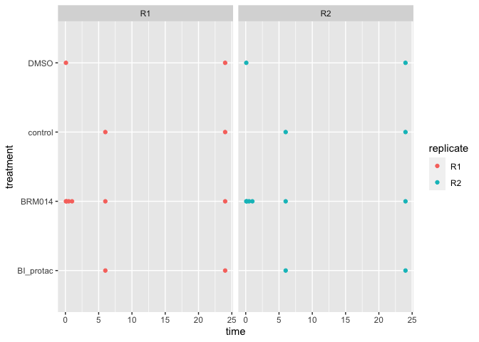<!-- -->

*In this study, one of the things they were comparing was BRM014 to
DMSO. The drug BRM014 is dissolved in DMSO, so DMSO alone is the
appropriate control to gauge the effect of BRM014.*

### `#?#` *Can we compare BRM014 to DMSO across all time points? Why/why not? - 1 pt*

``` r
#No, we cannot compare BRM014 to DMSO at all time points because there is no DMSO data available for the 6h time point. 
```

# Part 2: QC

*With most genomics data, it is important both that samples have
sufficient coverage, and that the samples have similar coverage. Either
case can lead to underpowered analysis, or misleading results. Calculate
the read coverage for each sample. *

### `#?#` Make a plot with read coverage on the y-axis (total number of reads) and the samples on the x-axis. - 3 pt\*

``` r
# there are many ways you could do this; one of which is using the melt/cast functions from reshape
readcoverage <- melt(atacSeqData, na.rm = FALSE) %>%
  group_by(variable) %>%
  summarize(sum = sum(value))
```

    ## Using region as id variables

``` r
ggplot(readcoverage, aes(x = variable, y = sum)) + geom_point() + theme(axis.text.x = element_text(angle=90)) + xlab('Sample') + ylab('Total number of Reads') + ggtitle('Read Coverage vs Samples')
```

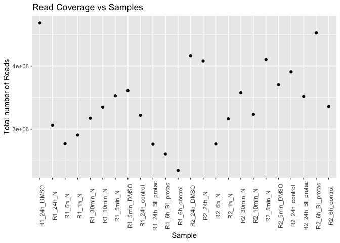<!-- -->

### `#?#` *Which sample has the most coverage? - 0.5 pt*

``` r
#R1_24h_DMSO
```

### `#?#` *Which sample has the least? - 0.5 pt*

``` r
#R1_6h_control
```

### `#?#` *What is the % difference between the max and min (relative to the min)? - 0.5 pt*

``` r
minimum <- min(readcoverage$sum)
maximum <- max(readcoverage$sum)

((maximum-minimum)/minimum)*100
```

    ## [1] 100.1533

``` r
((4686253 - 2341332)/2341332)*100
```

    ## [1] 100.1533

``` r
#100.15% 
```

### `#?#` *Suppose you have two samples only one of which has sufficient coverage, but having significantly more coverage than the other. Briefly discuss the advantage(s) and disadvantage(s) of downsampling one to make the coverage more similar between samples. - 3 pt*

``` r
#Downsampling has some advantages such as definitively removing library size-associated trends that are due to differences in variance. This can be helpful when you are trying to check for subtle affects such as trajectories. However, it can become a challenge if you downsample routinely. If your downsampling results disagree with your original results, you'll never know if that was because the latter was an artifact of differences in depth between batches or if the downsampling threw away resolution of genuine biology. By dropping reads line by line, we risk dropping a read and keeping its pair, and vice versa, not to mention supplementary and secondary alignments. We must avoid this in order for the simulation to reflect reality and for the resulting SAM file to remain valid.
```

*For this assignment, we will look only at BI_protac vs control data. *

### `#?#` *Create a new data.frame containing only the BI_protac and control samples. - 1 pt*

``` r
df <- subset(atacSeqData, select = -c(R1_24h_DMSO, R1_24h_N, R1_6h_N, R1_1h_N, R1_30min_N, R1_10min_N, R1_5min_N, R1_5min_DMSO, R2_24h_DMSO, R2_24h_N, R2_6h_N, R2_1h_N, R2_30min_N, R2_10min_N, R2_5min_N, R2_5min_DMSO))
df <- column_to_rownames(df, var="region")
```

### `#?#` *For this subset, calculate the counts per million reads (CPM) for each sample - 2 pt*

``` r
#myCPM <- apply(df, 2, function(x){x/sum(x)*10^6})
#myCPM <- as.data.frame(myCPM)
#Or use the cpm function in EdgeR 
myCPM <- cpm(df)
myCPM <- as.data.frame(myCPM)
```

### `#?#` *Plot the kernel density estimate for CPM (x axis). 1 curve per sample, different colours per curve. - 1 pt*

``` r
myCPM <- tibble::rownames_to_column(myCPM, "chromosome")
myCPM <- as.data.frame(myCPM)
melted_myCPM <- melt(myCPM)
```

    ## Using chromosome as id variables

``` r
ggplot(melted_myCPM, aes(x = value, colour = variable)) + geom_density()
```

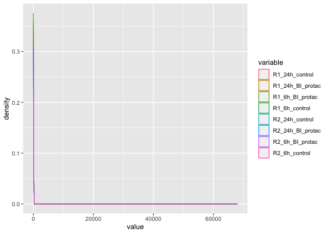<!-- -->

### `#?#` *Plot the kernel density estimate for log(CPM+1) (x axis), coloured as before - 1 pt*

``` r
#log_myCPM <- apply(df, 2, function(x){log(x+1)})
log_myCPM <- cpm(df, normalized.lib.sizes=TRUE, log=TRUE, prior.count=1)
log_myCPM <- as.data.frame(log_myCPM)
log_myCPM_melted <- melt(log_myCPM)
```

    ## Using  as id variables

``` r
ggplot(log_myCPM_melted, aes(x= value, colour=variable)) + geom_density() + ggtitle('Kernel Density Estimate for Log(CPM+1)')
```

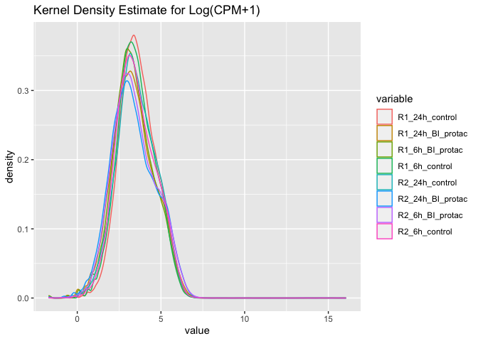<!-- -->

### `#?#` *Why do you think log-transforming is usually performed when looking at genomics data? - 1 pt*

``` r
#Log transforming makes your data more symmetrical and reduces the impact of fluctuations in the counts for the high-abudance genes. By log transforming you data becomes better for conducting statistical analysis. In this case, the data is better represented by log-transforming as we can see through the plots above.  
```

### `#?#` *Why do you think we add 1 before log transforming? - 1 pt*

``` r
#We add one while doing a log transformation so as to avoid log(x) approaching negative infinity as x approaches zero. 
```

### `#?#` *Some regions have very large CPMs. Seperate the peaks for which CPM\>300. -1.5 pt*

``` r
#melted_df <- cbind(rownmaes(df), data.frame(df, row.names=NULL))
#melted_df <- tibble::rownames_to_column(df, "chromosome")
#melted_df <- as.data.frame(melted_df)
#melted_df <- cpm(melted_df)
#melted_df <- melt(melted_df)
CPM300 <- melted_myCPM %>% 
  filter(value > 300)
```

### `#?#` *Make a bar plot of the number peaks for which CPM\>300 found on each chromosome. What do you notice? - 1.5 pt*

``` r
CPM300 <- CPM300 %>%
  mutate(chromosome = sapply(strsplit(chromosome, ":"), "[", 1))

ggplot(CPM300, aes(x = chromosome, fill = chromosome)) + geom_bar() + theme(axis.text.x = element_text(angle=90)) + ggtitle("Number of Peaks for CPM>300 in each Chromosome")
```

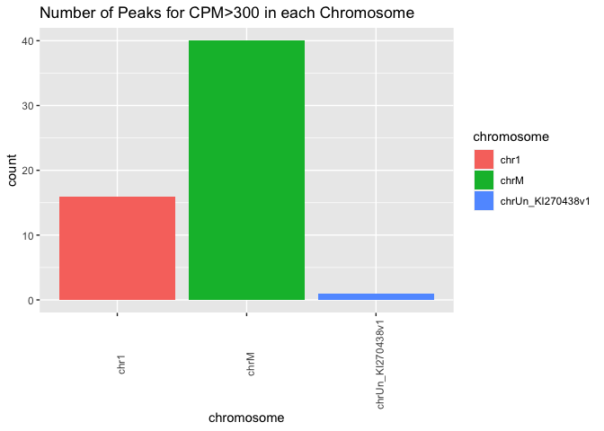<!-- -->

``` r
#The mitochondrial chromosome is seen to have the highest count followed by Chr1. We can see that ChrM has a count of 40, showing that 40 peaks for which CPM>300 compared to 16 counts for Chr1. 
```

*Normally, we would remove some of these regions before continuing (and
would redo the above steps). Since this is an assignment, we will
continue with the data as-is.*

*Often a good first step is to see if the data look good. One way to do
this is by seeing whether or not the signals in each sample correlate
with each other in ways you expect.*

### `#?#` *Calculate the pairwise correlations between log(CPM+1)s for the samples and plot them as a heatmap (samples x samples) - 3 pt*

``` r
#log_myCPM_heatmap <- as.matrix(log_myCPM)
log_cor <- cor(log_myCPM)


rownames <- rownames(log_cor)
annotations<- data.frame(sample = rownames,
                          replicates = c('24hr_control',
                                          '24hr_BI',
                                          '6hr_BI',
                                          '6hr_control',
                                          '24hr_control',
                                          '24hr_BI',
                                          '6hr_BI',
                                          '6hr_control'))%>%
  tibble::column_to_rownames('sample')


pheatmap::pheatmap(log_cor, main = "Pearson Correlation of Samples", cluster_rows = TRUE, cluster_cols = TRUE, annotation_col = annotations)
```

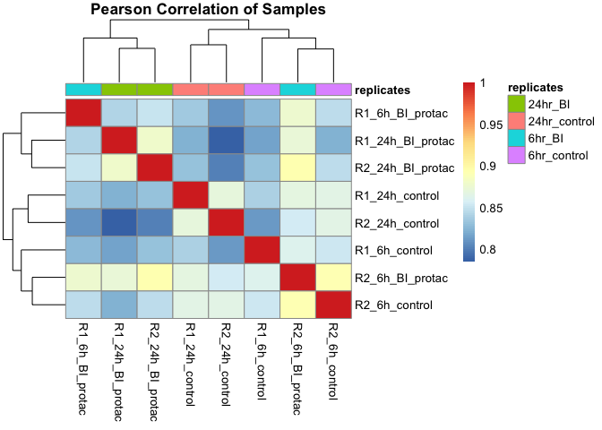<!-- -->

### `#?#` *What do you expect the correlations between replicates to look like? Is that what you see? - 2 pt*

``` r
#We expect the correlation between replicates to be strong. We can see that they are pretty well clustered.However, there are some discrepancies. For example, the 6hr_BI samples are pretty different for both replicates. But the 24_BI and 24control replicates cluster together pretty well. 
```

*It is common to exclude some regions from analysis. For instance, we
won’t be able to robustly identify those that are differential but have
low coverage even if they are truly differential, so there is no point
testing these. We will also remove mitochondrial regions, a common
contaminant of ATAC-seq data.*

### `#?#` *Filter your data, retaining only regions where the average counts per sample is greater than 20, and also remove mitochondrial regions - 3 pt*

``` r
raw_filtered <- df %>% 
  filter(rowMeans(df) > 20)
mitochondrial_regions <- str_detect(rownames(raw_filtered), 'chrM.')
raw_filtered <- raw_filtered[!str_detect(rownames(raw_filtered), 'chrM'),]
```

### `#?#` *How many peaks did you have before? How many do you have now? - 1 pt*

``` r
# Before we had 56617
# Now we have 42672
```

# Part 3: Differential ATAC

*We want to know what regions are differentially accessible between
BI_protac and the control.*

*Today, we’re going to use edgeR, which is designed for RNA-seq, but
works well on ATAC-seq as well. The user guide is here:*
<https://www.bioconductor.org/packages/release/bioc/vignettes/edgeR/inst/doc/edgeRUsersGuide.pdf>

### `#?#` *Make a count matrix called `countMatrix` for the BI_protac and control samples, including only the peaks we retained above - 2 pt*

``` r
countMatrix <- raw_filtered
```

*EdgeR is exceptionally versatile, with many different options for
analysis. Today, you’re going to use the GLM-quasi-likelihood approach
to calculate differential accessibility. We are providing the first
example analysis below, which you can modify in subsequent steps. You
will need to understand what the steps do, so read the appropriate
documentation. *

``` r
curSamples = samples[match(names(countMatrix), samples$ID),];
y = DGEList(counts=countMatrix, group=curSamples$treatment)
y = calcNormFactors(y)
designPaired = model.matrix(~curSamples$treatment + curSamples$timeName)  
# we are using timeName here to make sure that time is treated as a categorical variable. Had we more time points it might make sense to treat time as a value.
y = estimateDisp(y, designPaired)
fitPaired = glmQLFit(y, designPaired)
qlfPairedTime6vs24 = glmQLFTest(fitPaired, coef=3) 
qlfPairedTreatControlvsProtac = glmQLFTest(fitPaired, coef=2)

allDEStatsPairedTreatControlvsProtac = as.data.frame(topTags(qlfPairedTreatControlvsProtac,n=nrow(countMatrix)))
allDEStatsPairedTreatControlvsProtac$region=row.names(allDEStatsPairedTreatControlvsProtac)

allDEStatsPairedTime6vs24 = as.data.frame(topTags(qlfPairedTime6vs24,n=nrow(countMatrix)))
allDEStatsPairedTime6vs24$region=row.names(allDEStatsPairedTime6vs24)
```

*While the differential analysis has been done in this case, before we
look at the results, we are going to check if the data appear to be
normalized correctly. Also include a loess line of best fit, and the
line y=0.*

### `#?#` *Make an MA plot for allDEStatsPairedTreatControlvsProtac -2pt*

``` r
ggplot(allDEStatsPairedTreatControlvsProtac)+
  geom_point(mapping = aes(x = logCPM, y =  logFC))+
  geom_hline(yintercept = 0, color = 'steelblue', size = 2) +
  geom_smooth(mapping = aes(x = logCPM, y =  logFC), method = 'loess', color = 'red', se = FALSE)+
  labs(title = 'MA plot for Control vs Protac')
```

    ## Warning: Using `size` aesthetic for lines was deprecated in ggplot2 3.4.0.
    ## ℹ Please use `linewidth` instead.

    ## `geom_smooth()` using formula = 'y ~ x'

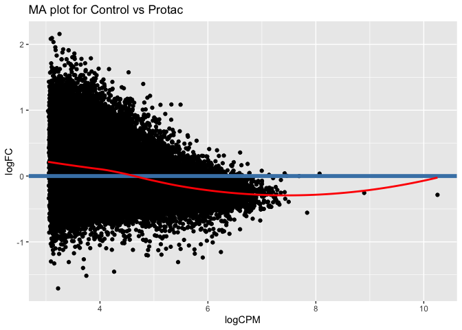<!-- -->

### `#?#` *Make an MA plot for allDEStatsPairedTime6vs24 - 1 pt*

``` r
ggplot(allDEStatsPairedTime6vs24)+
  geom_point(mapping = aes(x = logCPM, y =  logFC))+
  geom_hline(yintercept = 0, color = 'steelblue', size = 2) +
  geom_smooth(mapping = aes(x = logCPM, y =  logFC), method = 'loess', color = 'red', se = FALSE)+
  labs(title = 'MA plot for 6hr vs 24hr')
```

    ## `geom_smooth()` using formula = 'y ~ x'

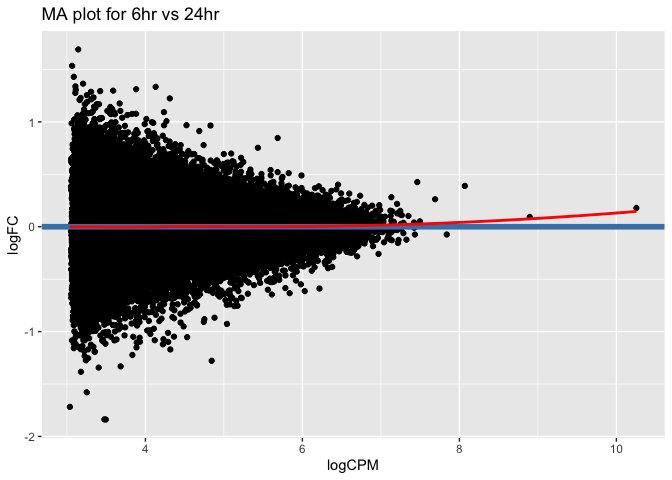<!-- -->

### `#?#` *Briefly explain what you are looking at. What do the axes show? What is the loess line for? - 2 pts*

``` r
#MAplots are used to show the logFC between experimental groups compared to the logCPM between experimental groups. The y axis is LogFC and the X axis is LogCPM. The Loess line is to show the relationship between LogFC ~ LogCPM. The loess line shows a non-linear relationship. 
```

*Now we’re going to test loess normalization instead.*

### `#?#` *Perform the same differential peak analysis using loess regularization. - 1 pt*

``` r
#Note: the Bioconductor package csaw implements loess regularization in a way that is compatible with edgeR
## Tip: use the csaw library to implement the loess regularization

# Retrieve relevant metadata
curSamples = samples[match(names(countMatrix), samples$ID),];

# Create a DGEList object with counts, and treatment metadata
y = DGEList(counts=normOffsets(countMatrix), group=curSamples$treatment)

# Calculate the loess regularization offsets
y = normOffsets(y, se.out=TRUE)

# Calculate normalization factors for mean-variance normalization
#y = calcNormFactors(y)

# Create a model matrix to instruct model of our categorigal variables
# Our model is going to include the main effects of treatment and time. time is categorical here
designPaired_loess = model.matrix(~curSamples$treatment + curSamples$timeName)  

# Add the estimated dispersion and add to DGEList object
y = estimateDisp(y, designPaired_loess)

# Fit linear model
fitPaired_loess = glmQLFit(y, designPaired_loess)
#coefficients(fitPaired)

# Perform simple test to look at how accessability changes between 6h and 24h
qlfPairedTime6vs24_loess = glmQLFTest(fitPaired_loess, coef=3)

# Perform simple test to look at how accessability changes between treatment and control
qlfPairedTreatControlvsProtac_loess = glmQLFTest(fitPaired_loess, coef=2)

# Look at top differentially accessable regions between treatment and control
allDEStatsPairedTreatControlvsProtac_loess = as.data.frame(topTags(qlfPairedTreatControlvsProtac_loess,
                                                             n=nrow(countMatrix)))
allDEStatsPairedTreatControlvsProtac_loess$region=row.names(allDEStatsPairedTreatControlvsProtac_loess)

# Look at top differentially accessable regions between 6h and 24hr
allDEStatsPairedTime6vs24_loess = as.data.frame(topTags(qlfPairedTime6vs24_loess,
                                                  n=nrow(countMatrix)))
allDEStatsPairedTime6vs24_loess$region=row.names(allDEStatsPairedTime6vs24_loess)
```

### `#?#` *Make the same two MA plots as before, but this time using the loess normalized analysis - 1 pt*

``` r
ggplot(allDEStatsPairedTreatControlvsProtac_loess)+
  geom_point(mapping = aes(x = logCPM, y =  logFC))+
  geom_hline(yintercept = 0, color = 'steelblue', size = 2) +
  geom_smooth(mapping = aes(x = logCPM, y =  logFC), method = 'loess', color = 'red', se = FALSE)+
  labs(title = 'MA plot for Control vs Protac using Loess Normalization')
```

    ## `geom_smooth()` using formula = 'y ~ x'

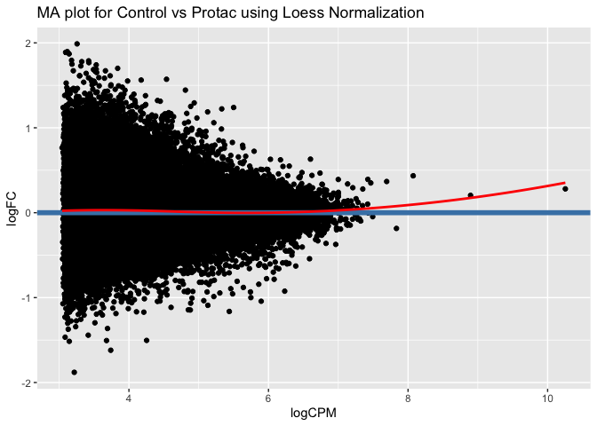<!-- -->

``` r
ggplot(allDEStatsPairedTime6vs24_loess)+
  geom_point(mapping = aes(x = logCPM, y =  logFC))+
  geom_hline(yintercept = 0, color = 'steelblue', size = 2) +
  geom_smooth(mapping = aes(x = logCPM, y =  logFC), method = 'loess', color = 'red', se = FALSE)+
  labs(title = 'MA plot for 6hr vs 24hr using Loess Normalization')
```

    ## `geom_smooth()` using formula = 'y ~ x'

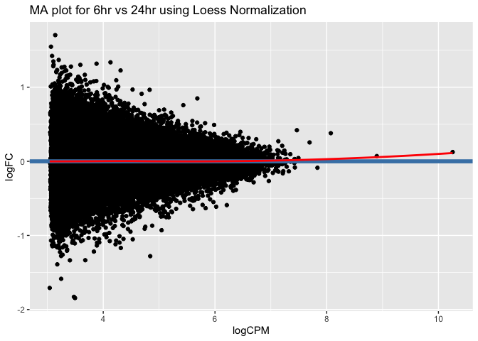<!-- -->

### `#?#` *Make the same two MA plots as before, but this time using the loess normalized analysis - 1 pt*

``` r
ggplot(allDEStatsPairedTreatControlvsProtac_loess)+
  geom_point(mapping = aes(x = logCPM, y =  logFC))+
  geom_hline(yintercept = 0, color = 'steelblue', size = 2) +
  geom_smooth(mapping = aes(x = logCPM, y =  logFC), method = 'loess', color = 'red', se = FALSE)+
  labs(title = 'MA plot for Control vs Protac using Loess Normalization')
```

    ## `geom_smooth()` using formula = 'y ~ x'

<!-- -->

``` r
ggplot(allDEStatsPairedTime6vs24_loess)+
  geom_point(mapping = aes(x = logCPM, y =  logFC))+
  geom_hline(yintercept = 0, color = 'steelblue', size = 2) +
  geom_smooth(mapping = aes(x = logCPM, y =  logFC), method = 'loess', color = 'red', se = FALSE)+
  labs(title = 'MA plot for 6hr vs 24hr using Loess Normalization')
```

    ## `geom_smooth()` using formula = 'y ~ x'

<!-- -->

### `#?#` *What was the first normalization method? What changed in the MA plots? Which analysis do you think is more reliable and why? - 4 pt*

*Hint: Think about what loess normalization corrects for.*

``` r
#The first normalization method is TMM. The TMM method normalizes by "effective library size" which is kinda like library size, but the variance of the sample is also taken into account.  From what we found. Loess Normalization typically performs better than just TMM normalization In our case, in the TMM method the loess curve for the allDEStatsPairedTreatControlvsProtac model is not flat, which is undesirable. But Loess normalization fixes this. Loess normalization corrects for relationships between the FC and CPM. In other words, if the data shows that a gene's CPM tends to effect the genes FC between experimental conditions, than that relationship is removed. This is done because the relationship is likely a technical artifact, and not a biological signal. I think this normalization makes the data more reliable.
```

# Part 4: GC bias

*Next, we will look at potential GC bias in the data. We will again use
bioconductor *

### `#?#` *Convert the region IDs to a GRanges object - 3 pt*

``` r
#note that the names of your peaks are of the format <chr>:<startPos>-<endPos>
## Tip: look into the GenomicRanges documentation
chr <- sapply(strsplit(myCPM$chromosome, ":"), "[", 1)
ranges <- sapply(strsplit(myCPM$chromosome, ":"), "[", 2)
start <- sapply(strsplit(ranges, "-"), "[", 1)
end <- sapply(strsplit(ranges, "-"), "[", 2)
df <- data.frame(chr=chr, start=start, end=end)
GRanges_object <- makeGRangesFromDataFrame(df)
```

### `#?#` *Extract the genomic DNA sequences for each peak using hg38 - 3 pt*

*See for relevant documentation:
<https://bioconductor.org/packages/release/workflows/vignettes/sequencing/inst/doc/sequencing.html>
*

``` r
## Tip: Use the Biostring library 
library(BSgenome.Hsapiens.UCSC.hg38)
```

    ## Loading required package: BSgenome

    ## Warning: package 'BSgenome' was built under R version 4.2.2

    ## Loading required package: rtracklayer

``` r
hg_chrs = getChromInfoFromUCSC('hg38')
hg_chrs = subset(hg_chrs)
seqlengths = with(hg_chrs, setNames(size, chrom))

#tilling_window = unlist(tileGenome(
    #seqlengths = seqlengths, 
    #tilewidth  = 1000
#))
seq = getSeq(BSgenome.Hsapiens.UCSC.hg38, GRanges_object)
# calculates the frequency of all possible dimers 
# in our sequence set
nuc = oligonucleotideFrequency(seq, width = 2)

# converts the matrix into a data.frame
nuc = as.data.frame(nuc)

# calculates the percentages, and rounds the number
nuc = round(nuc/width(GRanges_object),3)
```

*Now we will see if there’s any relationship between peak CPM and GC
content for each of the samples.*

### `#?#` *Create scatter plots (one per sample, e.g. using facet_wrap), including lines of best fit (GAM), where each plot shows GC content (x axis) vs CPM (y axis) for each peak (points) -2pt*

``` r
#please limit the y axis to between 0 and 50
gc <- cbind(data.frame(myCPM), GC = nuc['GC'])
melted_gc <- melt(gc, id = c("GC", "chromosome"))
ggplot(
    data = melted_gc, 
    aes(
        x = GC, 
        y = value
    )) +
  geom_point(size=1, alpha=.3) +
  theme_bw() +
  theme(
    axis.text  = element_text(size=10, face='bold'),
    axis.title = element_text(size=14,face="bold"),
    plot.title = element_text(hjust = 0.5)) +
  xlab('GC content') +
  ylab('CPM') +
  ggtitle("GC content vs CPM") + facet_wrap(~variable) + geom_smooth(method = 'gam') + ylim(0, 50)
```

    ## `geom_smooth()` using formula = 'y ~ s(x, bs = "cs")'

    ## Warning: Removed 16382 rows containing non-finite values (`stat_smooth()`).

    ## Warning: Removed 16382 rows containing missing values (`geom_point()`).

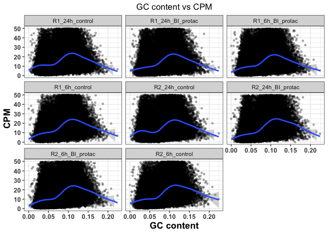<!-- -->

### `#?#` *Repeat the above, but this time showing only the lines of best fit and all on the same plot - 2 pt*

``` r
ggplot(data = melted_gc, aes(x = GC, y = value, colour = variable)) + xlab('GC content') +
  ylab('CPM') + geom_smooth(method = 'gam', se = FALSE, alpha = 0.05) + ggtitle('Line of Best fit for CPM vs GC Content')
```

    ## `geom_smooth()` using formula = 'y ~ s(x, bs = "cs")'

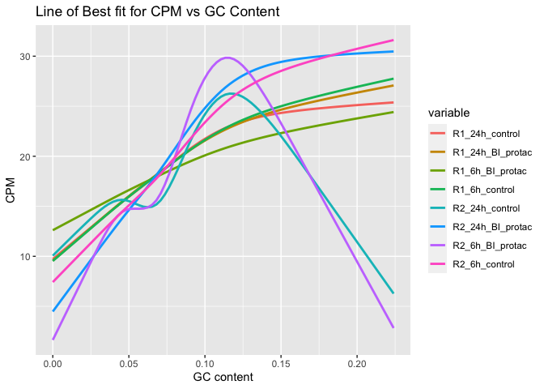<!-- -->

### `#?#` *Given this result, predict whether we will see a significant relationship between GC content and logFC in our differential peak analysis (loess-normalized). Justify your prediction. Predicting “wrong” will not be penalized, as long as your justification is correct. Don’t retroactively change your answer. - 2 pt*

``` r
#Yes, we will see a significant relationship between GC content and the logFC (loess-normalized) plot. This is because in the GC content vs the CPM data, we see there is a significant relationship between them. We expect that loess normalization will correct for non-linear trends in logFC ~ logCPM. 
```

### `#?#` *Plot the relationship between GC and logFC for the loess-normalized ControlvsProtac analysis. Also include a line of best fit (blue) and y=0 (red) - 2 pt*

``` r
colnames(gc)[1] = "region"
gclogFC_join <- left_join(allDEStatsPairedTreatControlvsProtac_loess, gc, join_by('region')) #joining the two datasets together by chromosome region 
gclogFC_join <- gclogFC_join %>% select(-c(logCPM, F, PValue, FDR)) #removing unwanted columns 
```

``` r
ggplot(gclogFC_join)+
  geom_point(mapping = aes(x = GC, y =  logFC))+
  geom_hline(yintercept = 0, color = 'red', linewidth = 1) +
  geom_smooth(mapping = aes(x = GC, y =  logFC), method = 'loess', color = 'steelblue', se = FALSE)+
  labs(title = 'GC vs logFC for loess-normalized')
```

    ## `geom_smooth()` using formula = 'y ~ x'

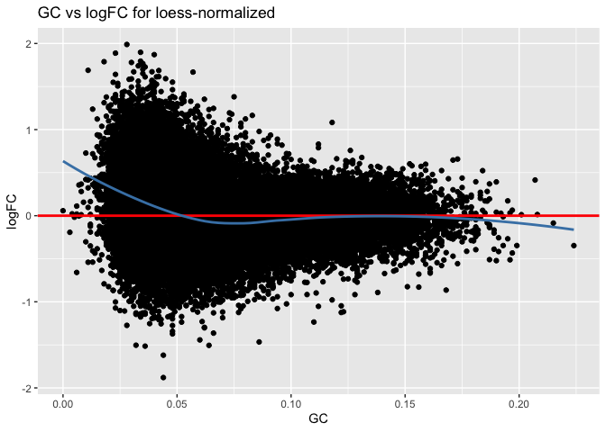<!-- -->

### `#?#` *Now plot the same thing for the NON loess-normalized ControlvsProtac analysis. - 1 pt*

``` r
#performing the same steps above but for the non-loess normalized dataset. 
gclogFC_join_non <- left_join(allDEStatsPairedTreatControlvsProtac, gc, join_by('region'))
gclogFC_join_non <- gclogFC_join_non %>% select(-c(logCPM, F, PValue, FDR))
```

``` r
ggplot(gclogFC_join_non)+
  geom_point(mapping = aes(x = GC, y =  logFC))+
  geom_hline(yintercept = 0, color = 'red', linewidth = 1) +
  geom_smooth(mapping = aes(x = GC, y =  logFC), method = 'loess', color = 'steelblue', se = FALSE)+
  labs(title = 'GC vs logFC for NON loess-normalized')
```

    ## `geom_smooth()` using formula = 'y ~ x'

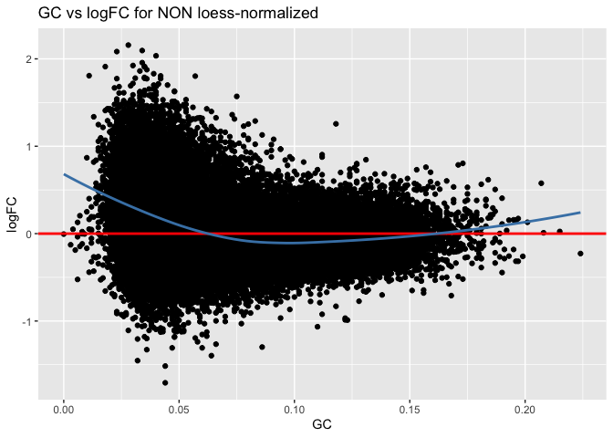<!-- -->

### `#?#` *Was your prediction correct? Do you think we should also account for GC normalization in our differential ATAC analysis? Why/why not? - 3 pt*

``` r
#Yes, we do believe our prediction is correct. In the above plots, we can see that there is a relationship between GC content and logFC. It is better using the loess-normalization than the non loess-normalization. Yes we should account for GC normalization in our differential ATAC analysis because accounting for GC content effects improve accuracy and accountability. However, exploratory analysis is required to guide the appropriate choice of normalization. 
```

*We will leave GC normalization as an optional exercise, and will not
actually do it here.*

# Part 5: Differential analysis results

### `#?#` *Suppose we perform the analyses above, redoing the differential analysis once more with GC normalization, and also considering that we tested loess and the default normalization methods. Did we P-hack? Why or why not? - 2 pt*

``` r
#No, we did not p-hack. When you p-hack you might be making multiple different models and performing multiple different anylsis' to try and identify the model that provides the result you are desiring. Here, we are performing multiple different analysis' for each time we normalize. But we have GOOD REASON to do so. We have looked at our data, and realised that the data distribution does not match the distribution that is expected of our model. Therefore, we need to normalize the data.
```

*Going forward, we will only use the initial analysis (**not loess
normalized**)*

### `#?#` *Now considering the two comparisons (6 vs 24 hours, and protac vs control). EdgeR performed a correction for MHT, but if we want to analyze the results from both comparisons, do we need to re-adjust to account for the fact that we tested two different hypothesis sets (time and treatment)? Why/not? - 2 pt*

``` r
#Yes. We performed BH MHT correction when looking at both main effects individually. But because we've performed 2 different tests, and have not corrected across them. When we look at both the results, we will have more false positives than we expect from our FDR correction. So we have to re-adjust. In Limma, you can do this with limma::decideTests, which allows you to specify what contrasts you want to test, and then it performs those tests, pools the P-values, and performs FDR correction on the pooled Pvalues.
```

### `#?#` *How many differential peaks did you find (FDR\<0.01). - 1 pt*

``` r
differential_peaks <- allDEStatsPairedTreatControlvsProtac %>% 
  filter(FDR < 0.01)

# With filtering out low counts, we have 198 Differentially accessible regions
```

### `#?#` *Make a volcano plot of the allDEStatsPairedTreatControlvsProtac, with -log10(p-value) on the y axis and logFC on the x. Colour points that are significant at an FDR\<0.01. - 2 pt*

``` r
allDEStatsPairedTreatControlvsProtac <- allDEStatsPairedTreatControlvsProtac %>%
  mutate(sig = case_when(FDR < 0.01 ~ "TRUE", 
                                FDR >=0.01 ~ "FALSE"))
allDEStatsPairedTreatControlvsProtac$sig <- factor(allDEStatsPairedTreatControlvsProtac$sig, levels = c("TRUE", "FALSE"))


ggplot(allDEStatsPairedTreatControlvsProtac) +
  geom_point(mapping = aes(x = logFC, y =-log(FDR, base = 10), color = sig)) + 
  labs(title = 'Volcano plot for 6hr vs 24hr main effect')+
  ylab('-log10 FDR')+
  xlab('logFC')
```

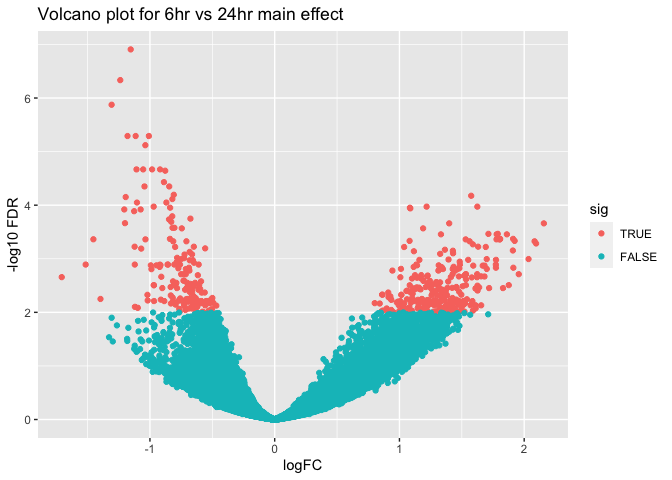<!-- -->

### `#?#` *Plot the logCPM (x axis) by -log10(Pvalue) (y axis), again colouring by FDR\<0.01. - 2 pt*

``` r
ggplot(allDEStatsPairedTreatControlvsProtac) +
  geom_point(mapping = aes(x = logCPM, y =-log(PValue, base = 10), color = sig)) + 
  labs(title = 'Volcano plot for 6hr vs 24hr main effect')+
  ylab('-log10 PValue')+
  xlab('logCPM')
```

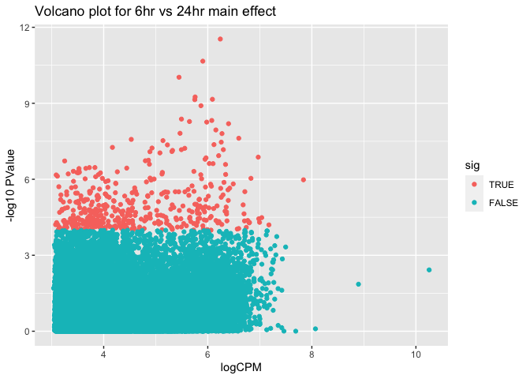<!-- -->

### `#?#` *Do you think our initial filtering on peaks with at least 10 reads on average per sample was a good choice? Why or why not?*

``` r
#The question here is if the regions we filtered out had a low enough read count such that they would never produce significant peaks, or their read count is too low to be interpretable. We want to remove these types of regions prior to performing statistical anylsis on regions we care about because if we included them in our analysis, then FDR ajustments would make it such that we would have less power to identify significant peaks in our regions of interest.

#To investigate this, we did the analysis above using NON-filtered data. We only found 3 significantly differentiably accessible peaks. This lends confidence to the idea that we want to filter out these regions we know are low quality data, so we have more power in our analyisis' we care about.
```

*At this point there are many other follow ups you can and would do for
a real differential analysis, but we leave these as optional exercises.
For example:* 1. Confirming that the differential peaks look correct
(e.g. CPM heatmap) 2. Confirming that peaks look differential on the
genome browser 3. Looking for motif enrichment 4. Performing a GREAT
analysis, including functional enrichment and assigning peaks to genes

*Knit your assignment as a github_document and submit the resulting .md
and this .Rmd to your github, and complete the assignment submission on
Canvas. Make sure to include the graphs with your submission. *

# References

<https://gatk.broadinstitute.org/hc/en-us/articles/360047717551-Downsampling-in-GATK>
<https://support.bioconductor.org/p/130707/>
<https://support.bioconductor.org/p/9145189/>
<https://www.ncbi.nlm.nih.gov/pmc/articles/PMC3358649/>
<https://compgenomr.github.io/book/chip-quality-control.html#gc-bias-quantification>

# Authors and contributions

Following completion of your assignment, please fill out this section
with the authors and their contributions to the assignment. If you
worked alone, only the author (e.g. your name and student ID) should be
included.

Authors: Rishika Daswani (59028654) and Alex Adrian (32879231)

Contributions: Rishika worked on the code for parts 1 and 4, Alex worked
on the code for parts 3 and 5. Part 2 and the theoretical questions were
worked on together.
